# StreamMQ 详细设计文档

> 配套 PRD：[01-PRD.md](./01-PRD.md)　架构：[02-architecture.md](./02-architecture.md)　功能设计：[03-functional-design.md](./03-functional-design.md)
> 本文档定义 StreamMQ 内部实现细节：内部类、算法伪代码、线程模型、Redis Key 操作、状态机、异常降级。外部 API 以 03-functional-design.md 为准，本文档不修改对外契约。

| 字段 | 内容 |
|---|---|
| 文档版本 | v0.1-draft |
| 状态 | 起草中 |
| 创建日期 | 2026-06-30 |
| 配套 PRD | v0.1-draft |
| 配套架构 | v0.1-draft |
| 配套功能设计 | v0.1-draft |
| 技术栈 | JDK 21 / Spring Boot 3.3.x / Redisson 3.34.x / Redis 7.2+ |
| 文档语言 | 中文（Javadoc/注释中文，标识符英文） |
| 许可协议 | MIT |

---

## 目录

1. [文档信息](#1-文档信息)
2. [详细设计总览](#2-详细设计总览)
3. [核心内部类设计](#3-核心内部类设计)
4. [关键算法伪代码](#4-关键算法伪代码)
5. [线程模型与并发控制](#5-线程模型与并发控制)
6. [Redis Key 操作全集](#6-redis-key-操作全集)
7. [关键时序图](#7-关键时序图)
8. [内部状态机设计](#8-内部状态机设计)
9. [异常处理与降级策略](#9-异常处理与降级策略)
10. [性能优化设计](#10-性能优化设计)
11. [安全与可观测性内部实现](#11-安全与可观测性内部实现)
12. [附录](#12-附录)

---

## 1. 文档信息

| 项 | 内容 |
|---|---|
| 文档版本 | v0.1-draft |
| 当前状态 | 起草中 |
| 维护者 | StreamMQ 团队 |
| 变更记录 | 2026-06-30 v0.1 初稿建立，含内部类、算法、线程模型、Redis Key、状态机、降级、性能 |
| 相关文档 | 01-PRD.md / 02-architecture.md / 03-functional-design.md |
| 适用版本 | StreamMQ v1.0.x |
| 内部覆盖维度 | 内部类与职责 / 关键算法 / 线程模型 / Redis Key 操作 |
| Mermaid 表达 | classDiagram / sequenceDiagram / stateDiagram-v2 |

### 1.1 已确认的详细设计决策

| 编号 | 决策项 | 选定方案 | 关键要点 |
|---|---|---|---|
| D1 | 类图与时序图表达 | Mermaid | classDiagram / sequenceDiagram / stateDiagram-v2 |
| D2 | 内部覆盖维度 | 4 维度 | 内部类 / 算法 / 线程模型 / Redis Key |
| D3 | Rebalance 算法 | Gossip + RSemaphore（AP） | 心跳 Hash + 信号量仲裁 + 一致性 Hash 分配 |
| D4 | 事务回查 | 半消息 Stream + 状态 Hash + ZSet 扫描 | PREPARE/COMMIT/ROLLBACK/UNKNOWN 四态 |
| D5 | 重试与 DLQ | Lua 原子转移 | ZPOPMIN + XADD 单脚本完成 |
| D6 | 顺序消费锁 | Redisson RLock 可重入 | shard 级锁 + watchdog 续期 |

---

## 2. 详细设计总览

### 2.1 内部组件分层

StreamMQ 内部按 5 层组织，每层职责单一，依赖方向严格自上而下：

```
┌──────────────────────────────────────────────────────────────────┐
│  API 层（streammq-api）                                          │
│  - StreamMqTemplate<T> / MessageBuilder / Message<T>              │
│  - @StreamMqListener / @StreamMqProducer / @StreamMqTransactionListener │
└──────────────────────────────────────────────────────────────────┘
                              ↓
┌──────────────────────────────────────────────────────────────────┐
│  编排层（streammq-spring-boot-starter）                          │
│  - StreamMqAutoConfiguration / ListenerContainerRegistrar        │
│  - StreamMqProperties（配置绑定）                                 │
│  - Actuator HealthIndicator / Micrometer Metrics                 │
└──────────────────────────────────────────────────────────────────┘
                              ↓
┌──────────────────────────────────────────────────────────────────┐
│  Core 层（streammq-core）                                        │
│  - DefaultStreamMqTemplate / RedissonStreamProducer              │
│  - StreamMqListenerContainer / RedisStreamConsumer               │
│  - ConsumerGroupManager / RetryScheduler                         │
│  - TransactionScanner / DelayMessageScheduler                    │
│  - Interceptor / Serializer / RetryPolicy / RebalanceStrategy SPI │
└──────────────────────────────────────────────────────────────────┘
                              ↓
┌──────────────────────────────────────────────────────────────────┐
│  适配层（streammq-native / kafka-compat / amqp-compat）          │
│  - NativeProducer / NativeConsumer                               │
│  - KafkaProducer / KafkaConsumer                                 │
│  - AmqpChannel                                                   │
└──────────────────────────────────────────────────────────────────┘
                              ↓
┌──────────────────────────────────────────────────────────────────┐
│  底层（streammq-redisson-adapter）                                │
│  - RedissonStreamTemplate（RStream 封装）                        │
│  - RedissonBatchTemplate（RBatch 封装）                          │
│  - RedissonZSetTemplate（延时 / 重试 ZSet）                      │
│  - RedissonLockTemplate（RLock 顺序消费锁）                      │
└──────────────────────────────────────────────────────────────────┘
                              ↓
                       Redis Server 7.2+
```

### 2.2 内部组件协作关系

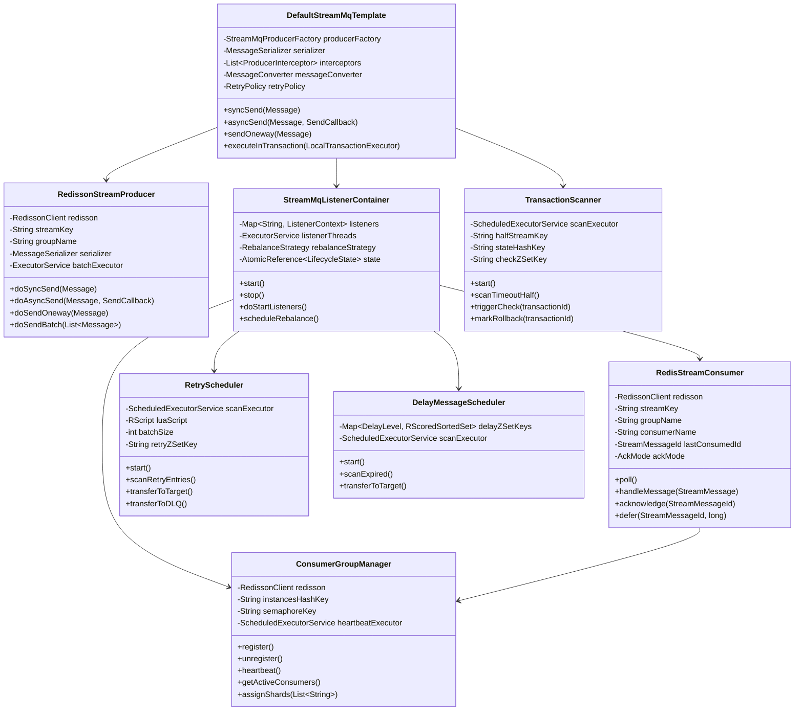
```mermaid
classDiagram
    class DefaultStreamMqTemplate {
        -StreamMqProducerFactory producerFactory
        -MessageSerializer serializer
        -List~ProducerInterceptor~ interceptors
        -MessageConverter messageConverter
        -RetryPolicy retryPolicy
        +syncSend(Message)
        +asyncSend(Message, SendCallback)
        +sendOneway(Message)
        +executeInTransaction(LocalTransactionExecutor)
    }
    class RedissonStreamProducer {
        -RedissonClient redisson
        -String streamKey
        -String groupName
        -MessageSerializer serializer
        -ExecutorService batchExecutor
        +doSyncSend(Message)
        +doAsyncSend(Message, SendCallback)
        +doSendOneway(Message)
        +doSendBatch(List~Message~)
    }
    class StreamMqListenerContainer {
        -Map~String, ListenerContext~ listeners
        -ExecutorService listenerThreads
        -RebalanceStrategy rebalanceStrategy
        -AtomicReference~LifecycleState~ state
        +start()
        +stop()
        +doStartListeners()
        +scheduleRebalance()
    }
    class RedisStreamConsumer {
        -RedissonClient redisson
        -String streamKey
        -String groupName
        -String consumerName
        -StreamMessageId lastConsumedId
        -AckMode ackMode
        +poll()
        +handleMessage(StreamMessage)
        +acknowledge(StreamMessageId)
        +defer(StreamMessageId, long)
    }
    class ConsumerGroupManager {
        -RedissonClient redisson
        -String instancesHashKey
        -String semaphoreKey
        -ScheduledExecutorService heartbeatExecutor
        +register()
        +unregister()
        +heartbeat()
        +getActiveConsumers()
        +assignShards(List~String~)
    }
    class RetryScheduler {
        -ScheduledExecutorService scanExecutor
        -RScript luaScript
        -int batchSize
        -String retryZSetKey
        +start()
        +scanRetryEntries()
        +transferToTarget()
        +transferToDLQ()
    }
    class TransactionScanner {
        -ScheduledExecutorService scanExecutor
        -String halfStreamKey
        -String stateHashKey
        -String checkZSetKey
        +start()
        +scanTimeoutHalf()
        +triggerCheck(transactionId)
        +markRollback(transactionId)
    }
    class DelayMessageScheduler {
        -Map~DelayLevel, RScoredSortedSet~ delayZSetKeys
        -ScheduledExecutorService scanExecutor
        +start()
        +scanExpired()
        +transferToTarget()
    }
    DefaultStreamMqTemplate --> RedissonStreamProducer
    DefaultStreamMqTemplate --> StreamMqListenerContainer
    StreamMqListenerContainer --> RedisStreamConsumer
    StreamMqListenerContainer --> ConsumerGroupManager
    RedisStreamConsumer --> ConsumerGroupManager
    StreamMqListenerContainer --> RetryScheduler
    StreamMqListenerContainer --> DelayMessageScheduler
    DefaultStreamMqTemplate --> TransactionScanner
```

### 2.3 与外部 API 的对应关系

| 外部 API（03-functional-design） | 内部实现类 | 说明 |
|---|---|---|
| `StreamMqTemplate<T>` 接口 | `DefaultStreamMqTemplate<T>` | 默认实现 |
| `@StreamMqProducer` 注入 | `StreamMqProducerFactory.create()` | 工厂按 group 创建 |
| `@StreamMqListener` / `@StreamMqOrderlyListener` | `StreamMqListenerContainer` | 容器扫描注册 |
| `StreamMqListener<T>` / `StreamMqAckListener<T>` | `RedisStreamConsumer` 持有引用 | 反射调用 |
| `MessageBuilder` | 静态工厂 + 链式 setter | 仅构造，不涉及 IO |
| `TransactionChecker` SPI | `TransactionScanner` 调用 | 反查回调 |
| `RetryPolicy` SPI | `RedisStreamConsumer` 调用 | 计算 nextRetryAt |
| `RebalanceStrategy` SPI | `ConsumerGroupManager` 调用 | 计算分片分配 |
| `@StreamMqTransactionListener` | `TransactionScanner` 注册表 | 类级注解扫描 |

---

## 3. 核心内部类设计

### 3.1 DefaultStreamMqTemplate<T>

**职责**：实现 `StreamMqTemplate<T>` 接口的默认实现，统一编排发送、拦截器、序列化、事务、重试。线程安全（stateless，可被多线程共享）。

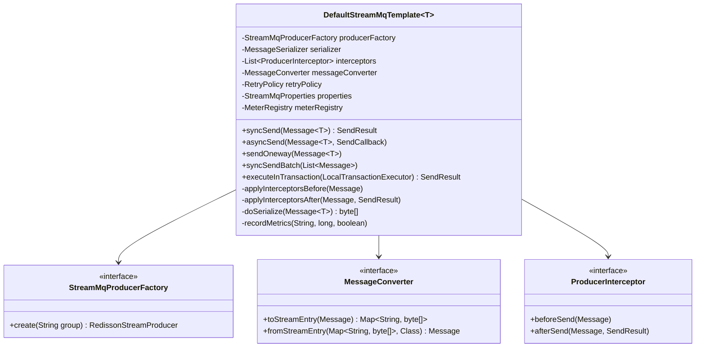
```mermaid
classDiagram
    class DefaultStreamMqTemplate~T~ {
        -StreamMqProducerFactory producerFactory
        -MessageSerializer serializer
        -List~ProducerInterceptor~ interceptors
        -MessageConverter messageConverter
        -RetryPolicy retryPolicy
        -StreamMqProperties properties
        -MeterRegistry meterRegistry
        +syncSend(Message~T~) SendResult
        +asyncSend(Message~T~, SendCallback)
        +sendOneway(Message~T~)
        +syncSendBatch(List~Message~)
        +executeInTransaction(LocalTransactionExecutor) SendResult
        -applyInterceptorsBefore(Message)
        -applyInterceptorsAfter(Message, SendResult)
        -doSerialize(Message~T~) byte[]
        -recordMetrics(String, long, boolean)
    }
    class StreamMqProducerFactory {
        <<interface>>
        +create(String group) RedissonStreamProducer
    }
    class MessageConverter {
        <<interface>>
        +toStreamEntry(Message) Map~String, byte[]~
        +fromStreamEntry(Map~String, byte[]~, Class) Message
    }
    class ProducerInterceptor {
        <<interface>>
        +beforeSend(Message)
        +afterSend(Message, SendResult)
    }
    DefaultStreamMqTemplate --> StreamMqProducerFactory
    DefaultStreamMqTemplate --> MessageConverter
    DefaultStreamMqTemplate --> ProducerInterceptor
```

**Javadoc**：

```java
/**
 * StreamMqTemplate 默认实现。
 *
 * <p>负责：
 * <ul>
 *   <li>协调 ProducerInterceptor 链 before / after 调用</li>
 *   <li>调用 MessageSerializer 将 payload 序列化为 byte[]</li>
 *   <li>调用 MessageConverter 构造 Stream Entry（含 headers / messageId / timestamp）</li>
 *   <li>按发送语义分发到 RedissonStreamProducer（同步 / 异步 / oneway / 批量）</li>
 *   <li>事务消息编排：半消息发送 + 本地事务执行 + 状态更新</li>
 *   <li>Micrometer 指标埋点（success/fail/latency）</li>
 * </ul>
 *
 * <p>线程安全：stateless 字段全部 final，多线程共享单例。
 *
 * @param <T> 消息体类型
 */
public class DefaultStreamMqTemplate<T> implements StreamMqTemplate<T> { ... }
```

**关键字段**：

| 字段 | 类型 | 说明 |
|---|---|---|
| producerFactory | `StreamMqProducerFactory` | 按 group 创建 Producer |
| serializer | `MessageSerializer<T>` | payload → byte[] |
| interceptors | `List<ProducerInterceptor>` | 发送拦截器链（有序） |
| messageConverter | `MessageConverter` | Message ↔ Stream Entry |
| retryPolicy | `RetryPolicy` | 仅用于发送失败重试（非消费） |
| properties | `StreamMqProperties` | 配置（超时 / 重试次数） |
| meterRegistry | `MeterRegistry` | 指标埋点 |

**关键方法伪代码**：

```java
public SendResult syncSend(Message<T> message) {
    long start = System.nanoTime();
    SendResult result = null;
    try {
        // 1. 拦截器 before
        applyInterceptorsBefore(message);
        // 2. 序列化
        Map<String, byte[]> entry = messageConverter.toStreamEntry(message);
        // 3. 选择 Producer（按 group）
        RedissonStreamProducer producer = producerFactory.create(message.getGroup());
        // 4. 同步发送（含发送侧重试）
        result = producer.doSyncSend(entry, message);
        // 5. 拦截器 after
        applyInterceptorsAfter(message, result);
        recordMetrics("send.success", System.nanoTime() - start, true);
        return result;
    } catch (RuntimeException e) {
        recordMetrics("send.fail", System.nanoTime() - start, false);
        throw new StreamMqBrokerException("syncSend failed", e);
    }
}

public <R> SendResult executeInTransaction(LocalTransactionExecutor<R> executor) {
    String txId = UUID.randomUUID().toString();
    String txGroup = properties.getTransaction().getDefaultGroup();
    // 1. 半消息发送（写入 half stream，state=PREPARE）
    SendResult half = sendHalfMessage(txId, txGroup);
    // 2. 注册回查任务（ZSet score = now + checkInterval）
    registerTransactionCheck(txId, txGroup);
    try {
        // 3. 执行本地事务
        TransactionStatus status = executor.execute();
        // 4. 根据 status 写入 state Hash
        if (status == COMMIT) {
            markTransactionState(txId, txGroup, COMMIT);
            publishHalfMessage(txId, txGroup);  // 投递到业务 Stream
        } else {
            markTransactionState(txId, txGroup, ROLLBACK);
        }
        return half;
    } catch (RuntimeException e) {
        markTransactionState(txId, txGroup, ROLLBACK);
        throw new StreamMqTransactionException("local tx failed", e);
    }
}
```

### 3.2 RedissonStreamProducer<T>

**职责**：直接调用 Redisson `RStream` / `RBatch` 完成 Stream 写入，对上层屏蔽 Redisson API。

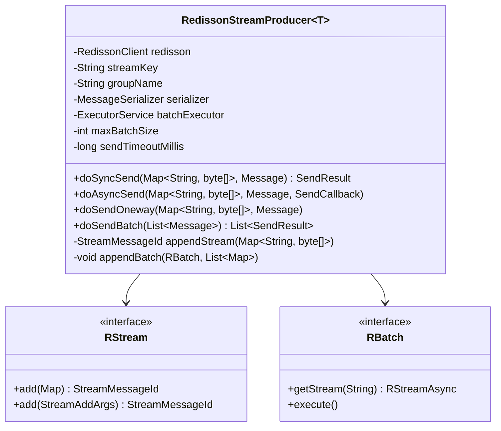
```mermaid
classDiagram
    class RedissonStreamProducer~T~ {
        -RedissonClient redisson
        -String streamKey
        -String groupName
        -MessageSerializer serializer
        -ExecutorService batchExecutor
        -int maxBatchSize
        -long sendTimeoutMillis
        +doSyncSend(Map~String, byte[]~, Message) SendResult
        +doAsyncSend(Map~String, byte[]~, Message, SendCallback)
        +doSendOneway(Map~String, byte[]~, Message)
        +doSendBatch(List~Message~) List~SendResult~
        -StreamMessageId appendStream(Map~String, byte[]~)
        -void appendBatch(RBatch, List~Map~)
    }
    class RStream {
        <<interface>>
        +add(Map) StreamMessageId
        +add(StreamAddArgs) StreamMessageId
    }
    class RBatch {
        <<interface>>
        +getStream(String) RStreamAsync
        +execute()
    }
    RedissonStreamProducer --> RStream
    RedissonStreamProducer --> RBatch
```

**关键方法伪代码**：

```java
public SendResult doSyncSend(Map<String, byte[]> entry, Message<?> message) {
    RStream<String, byte[]> stream = redisson.getStream(streamKey);
    // 含 MAXLEN 截断（按配置 maxlen 限制 Stream 长度）
    StreamAddArgs args = StreamAddArgs.entries(entry)
        .maxLen(properties.getStream().getMaxLen())
        .approximateTrimming();
    StreamMessageId id = stream.add(args);
    return new SendResult(id.toString(), SendStatus.SEND_OK, message.getMessageId());
}

public void doSendOneway(Map<String, byte[]> entry, Message<?> message) {
    // fire-and-forget：异步发送但不返回结果
    redisson.getExecutorService().submit(() -> {
        try { appendStream(entry); }
        catch (Exception e) { logger.warn("oneway send failed: {}", e.getMessage()); }
    });
}

public List<SendResult> doSendBatch(List<Message<?>> messages) {
    RBatch batch = redisson.createBatch();
    List<Map<String, byte[]>> entries = messages.stream()
        .map(messageConverter::toStreamEntry)
        .toList();
    // 构造 Batch 中每个 XADD
    for (Map<String, byte[]> entry : entries) {
        batch.getStream(streamKey).add(entry, StreamAddArgs.maxLen(maxLen).approximateTrimming());
    }
    BatchResult<?> result = batch.execute();
    // 按 failStrategy 处理（PARTIAL_SUCCESS / ALL_OR_NOTHING）
    return buildBatchResult(messages, result);
}
```

### 3.3 StreamMqListenerContainer

**职责**：管理所有 `@StreamMqListener` 注册的 Listener，按 group / topic 创建 Consumer，触发 Rebalance，调度消费线程。

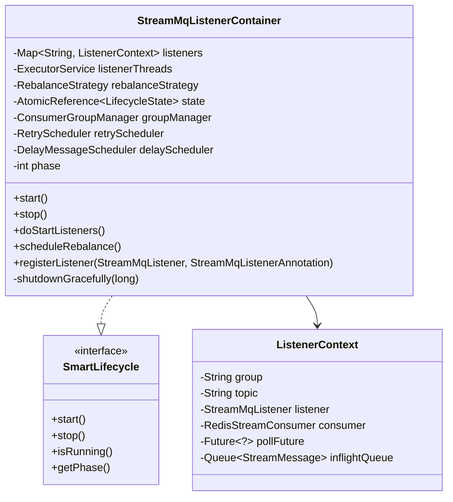
```mermaid
classDiagram
    class StreamMqListenerContainer {
        -Map~String, ListenerContext~ listeners
        -ExecutorService listenerThreads
        -RebalanceStrategy rebalanceStrategy
        -AtomicReference~LifecycleState~ state
        -ConsumerGroupManager groupManager
        -RetryScheduler retryScheduler
        -DelayMessageScheduler delayScheduler
        -int phase
        +start()
        +stop()
        +doStartListeners()
        +scheduleRebalance()
        +registerListener(StreamMqListener, StreamMqListenerAnnotation)
        -shutdownGracefully(long)
    }
    class ListenerContext {
        -String group
        -String topic
        -StreamMqListener listener
        -RedisStreamConsumer consumer
        -Future~?~ pollFuture
        -Queue~StreamMessage~ inflightQueue
    }
    class SmartLifecycle {
        <<interface>>
        +start()
        +stop()
        +isRunning()
        +getPhase()
    }
    StreamMqListenerContainer ..|> SmartLifecycle
    StreamMqListenerContainer --> ListenerContext
```

**关键方法伪代码**：

```java
@Override
public void start() {
    if (!state.compareAndSet(LifecycleState.INIT, LifecycleState.STARTING)) {
        throw new IllegalStateException("container already started");
    }
    // 1. 启动 RetryScheduler / DelayScheduler
    retryScheduler.start();
    delayScheduler.start();
    // 2. 注册所有 Listener 并创建 Consumer
    doStartListeners();
    // 3. 调度 Rebalance（周期触发）
    scheduleRebalance();
    state.set(LifecycleState.RUNNING);
}

private void doStartListeners() {
    for (ListenerContext ctx : listeners.values()) {
        // 每个 Listener 在独立虚拟线程上跑消费主循环
        Future<?> f = listenerThreads.submit(() -> {
            try { ctx.getConsumer().poll(); }
            catch (RuntimeException e) {
                logger.error("listener loop fatal: {}", ctx.getListenerName(), e);
                state.set(LifecycleState.ERROR);
            }
        });
        ctx.setPollFuture(f);
    }
}

@Override
public void stop() {
    state.set(LifecycleState.STOPPING);
    shutdownGracefully(properties.getShutdownTimeoutSeconds() * 1000L);
    retryScheduler.stop();
    delayScheduler.stop();
    listenerThreads.shutdown();
    state.set(LifecycleState.STOPPED);
}
```

### 3.4 RedisStreamConsumer

**职责**：执行 `XREADGROUP BLOCK` 主循环，反序列化，调用拦截器与 Listener，按 Action 处理 ACK / RECONSUME_LATER / DEFER。

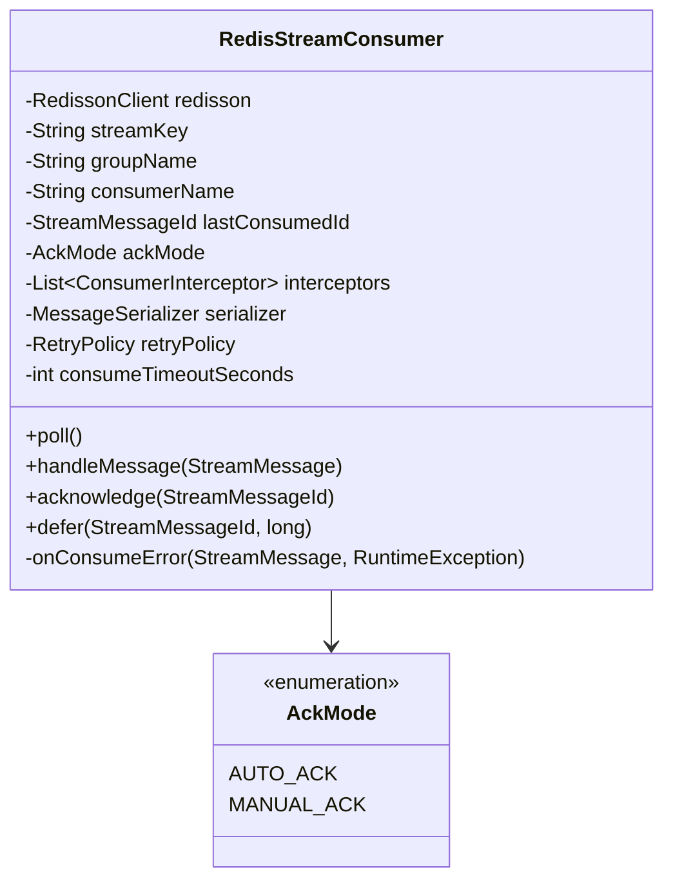
```mermaid
classDiagram
    class RedisStreamConsumer {
        -RedissonClient redisson
        -String streamKey
        -String groupName
        -String consumerName
        -StreamMessageId lastConsumedId
        -AckMode ackMode
        -List~ConsumerInterceptor~ interceptors
        -MessageSerializer serializer
        -RetryPolicy retryPolicy
        -int consumeTimeoutSeconds
        +poll()
        +handleMessage(StreamMessage)
        +acknowledge(StreamMessageId)
        +defer(StreamMessageId, long)
        -onConsumeError(StreamMessage, RuntimeException)
    }
    class AckMode {
        <<enumeration>>
        AUTO_ACK
        MANUAL_ACK
    }
    RedisStreamConsumer --> AckMode
```

**关键方法伪代码**：

```java
public void poll() {
    while (container.isRunning()) {
        // 1. XREADGROUP BLOCK
        Map<StreamMessageId, Map<String, byte[]>> messages = redisson
            .getStream(streamKey)
            .readGroup(groupName, consumerName,
                StreamReadGroupArgs.greaterThan(lastConsumedId)
                    .timeout(Duration.ofMillis(blockMillis))
                    .count(batchSize));
        if (messages == null || messages.isEmpty()) continue;
        // 2. 逐条处理
        for (var entry : messages.entrySet()) {
            StreamMessageId id = entry.getKey();
            Map<String, byte[]> fields = entry.getValue();
            try {
                handleMessage(new StreamMessage(id, fields));
            } catch (RuntimeException e) {
                onConsumeError(new StreamMessage(id, fields), e);
            }
        }
    }
}

private void handleMessage(StreamMessage sm) {
    // 1. 反序列化
    Message<?> message = messageConverter.fromStreamEntry(sm.getFields());
    // 2. ConsumerInterceptor before
    interceptors.forEach(i -> i.beforeConsume(message));
    // 3. 调用业务 Listener
    ConsumerContext ctx = new ConsumerContext(groupName, topic, sm.getId());
    Action action;
    try {
        action = listener.onMessage(message, ctx);
    } catch (RuntimeException e) {
        action = Action.RECONSUME_LATER;  // 异常兜底
    }
    // 4. 按 Action 处理
    switch (action) {
        case SUCCESS -> acknowledge(sm.getId());
        case RECONSUME_LATER -> {
            long nextRetryAt = retryPolicy.nextRetryAt(System.currentTimeMillis(),
                sm.getRetryCount() + 1);
            redisson.getScoredSortedSet(retryZSetKey).add(nextRetryAt,
                buildRetryEntry(sm, message, sm.getRetryCount() + 1));
            // 不 ack，消息留在 PEL（容器内先按 maxReconsumeTimes 原地重试，崩溃残留由 PelClaimScheduler 扫描重投补偿）
        }
        case DEFER -> defer(sm.getId(), ctx.getDeferMillis());
    }
}
```

### 3.5 ConsumerGroupManager

**职责**：管理 Consumer 实例注册、心跳、活跃列表维护、shard 分配（Rebalance）。基于 Gossip + RSemaphore 实现（决策 D3）。

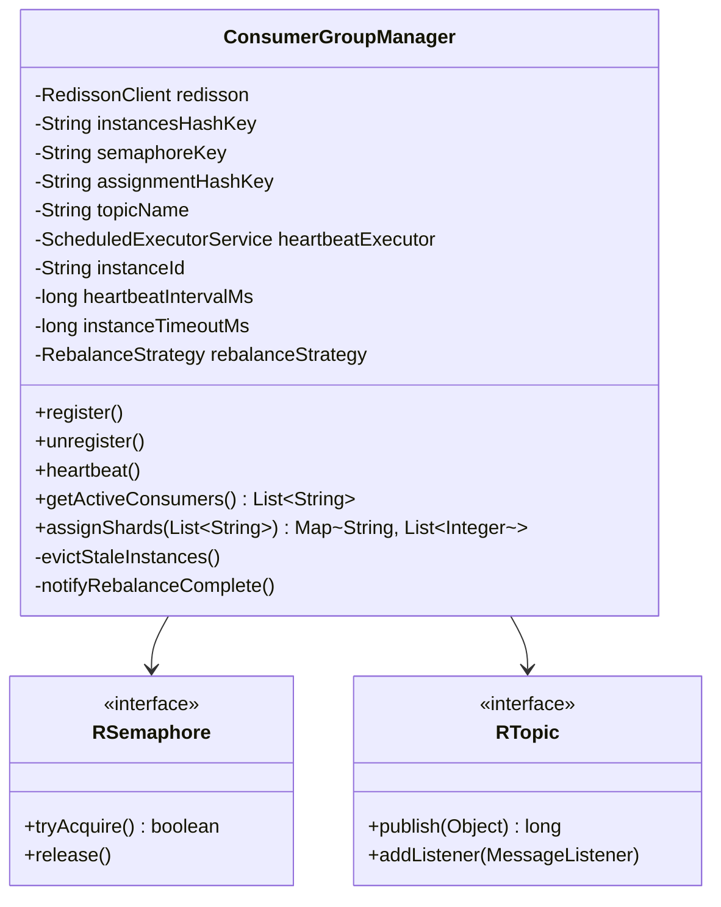
```mermaid
classDiagram
    class ConsumerGroupManager {
        -RedissonClient redisson
        -String instancesHashKey
        -String semaphoreKey
        -String assignmentHashKey
        -String topicName
        -ScheduledExecutorService heartbeatExecutor
        -String instanceId
        -long heartbeatIntervalMs
        -long instanceTimeoutMs
        -RebalanceStrategy rebalanceStrategy
        +register()
        +unregister()
        +heartbeat()
        +getActiveConsumers() List~String~
        +assignShards(List~String~) Map~String, List~Integer~~
        -evictStaleInstances()
        -notifyRebalanceComplete()
    }
    class RSemaphore {
        <<interface>>
        +tryAcquire() boolean
        +release()
    }
    class RTopic {
        <<interface>>
        +publish(Object) long
        +addListener(MessageListener)
    }
    ConsumerGroupManager --> RSemaphore
    ConsumerGroupManager --> RTopic
```

**Redis Key 设计**：

| Key 模式 | 类型 | 用途 |
|---|---|---|
| `streammq:cg:{group}:instances` | Hash | field=instanceId, value=lastHeartbeatTs |
| `streammq:cg:{group}:semaphore` | String | RSemaphore 跨节点仲裁 |
| `streammq:cg:{group}:assignment` | Hash | field=instanceId, value=shardIdList(CSV) |
| `streammq:cg:{group}:notify` | Topic | Rebalance 完成通知广播 |

**关键方法伪代码（D3 Gossip + RSemaphore）**：

```java
public void register() {
    // 1. 写入 instances Hash（首次注册）
    RMap<String, Long> instances = redisson.getMap(instancesHashKey);
    instances.put(instanceId, System.currentTimeMillis());
    // 2. 申请 RSemaphore（活跃数 +1）
    RSemaphore sem = redisson.getSemaphore(semaphoreKey);
    sem.tryAcquire();
    // 3. 订阅 notify Topic 接收 Rebalance 通知
    RTopic topic = redisson.getTopic(notifyTopicKey);
    topic.addListener(String.class, (channel, msg) -> {
        if ("REBALANCE".equals(msg)) scheduleRebalance();
    });
    // 4. 启动心跳
    heartbeatExecutor.scheduleAtFixedRate(this::heartbeat, 0,
        heartbeatIntervalMs, TimeUnit.MILLISECONDS);
}

public void heartbeat() {
    try {
        RMap<String, Long> instances = redisson.getMap(instancesHashKey);
        instances.put(instanceId, System.currentTimeMillis());
    } catch (RedisException e) {
        // 心跳失败累计，连续 3 次触发重连
        if (++heartbeatFailCount >= 3) triggerReconnect();
    }
}

public Map<String, List<Integer>> assignShards(List<String> activeInstances) {
    // 1. 通过 RSemaphore 仲裁（避免多节点并发分配冲突）
    RSemaphore sem = redisson.getSemaphore(semaphoreKey);
    if (!sem.tryAcquire(5, TimeUnit.SECONDS)) {
        return Collections.emptyMap();  // 抢锁失败，等其他节点算完
    }
    try {
        // 2. 调用 RebalanceStrategy 计算（默认 ConsistentHash）
        Map<String, List<Integer>> assignment =
            rebalanceStrategy.assign(activeInstances, shardCount);
        // 3. 写入 assignment Hash
        RMap<String, String> assignMap = redisson.getMap(assignmentHashKey);
        for (var e : assignment.entrySet()) {
            assignMap.put(e.getKey(), join(e.getValue(), ","));
        }
        // 4. 广播 REBALANCE 通知
        redisson.getTopic(notifyTopicKey).publish("REBALANCE");
        return assignment;
    } finally {
        sem.release();
    }
}

public List<String> getActiveConsumers() {
    RMap<String, Long> instances = redisson.getMap(instancesHashKey);
    long now = System.currentTimeMillis();
    // 剔除超时实例
    return instances.entrySet().stream()
        .filter(e -> now - e.getValue() < instanceTimeoutMs)
        .map(Map.Entry::getKey)
        .sorted()
        .toList();
}
```

### 3.6 RetryScheduler

**职责**：周期扫描重试 ZSet，将到期 entry 通过 Lua 脚本原子转移到目标 Stream 或 DLQ Stream（决策 D5）。

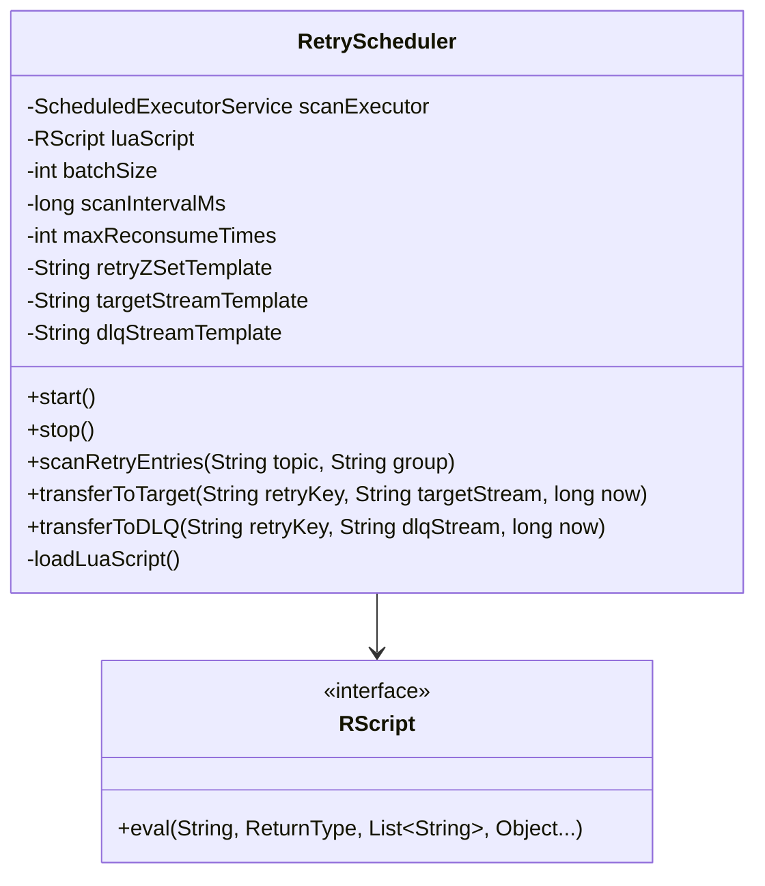
```mermaid
classDiagram
    class RetryScheduler {
        -ScheduledExecutorService scanExecutor
        -RScript luaScript
        -int batchSize
        -long scanIntervalMs
        -int maxReconsumeTimes
        -String retryZSetTemplate
        -String targetStreamTemplate
        -String dlqStreamTemplate
        +start()
        +stop()
        +scanRetryEntries(String topic, String group)
        +transferToTarget(String retryKey, String targetStream, long now)
        +transferToDLQ(String retryKey, String dlqStream, long now)
        -loadLuaScript()
    }
    class RScript {
        <<interface>>
        +eval(String, ReturnType, List~String~, Object...)
    }
    RetryScheduler --> RScript
```

**Lua 脚本（D5 原子转移）**：

```lua
-- KEYS[1] = retry ZSet
-- KEYS[2] = target Stream (业务 Stream)
-- KEYS[3] = DLQ Stream
-- ARGV[1] = now (ms)
-- ARGV[2] = batchSize
-- ARGV[3] = maxReconsumeTimes
-- 返回转移的 entry 数

local transferred = 0
local i = 0
while i < tonumber(ARGV[2]) do
    -- ZPOPMIN 取出 score 最小的（最老的到期 entry）
    local popped = redis.call('ZPOPMIN', KEYS[1])
    if #popped == 0 then break end
    local member = popped[1]
    local score = tonumber(popped[2])
    -- 未到期则放回（score 还原）
    if score > tonumber(ARGV[1]) then
        redis.call('ZADD', KEYS[1], score, member)
        break
    end
    -- 解析 member（JSON: {retryCount, fields, messageId, ...}）
    local entry = cjson.decode(member)
    local retryCount = entry['retryCount']
    if retryCount >= tonumber(ARGV[3]) then
        -- 进入 DLQ
        redis.call('XADD', KEYS[3], '*', 'body', member, 'reason', 'maxRetry')
    else
        -- 转投到目标 Stream
        local fields = entry['fields']
        redis.call('XADD', KEYS[2], '*', 'body', member)
    end
    transferred = transferred + 1
    i = i + 1
end
return transferred
```

**关键方法伪代码**：

```java
public void start() {
    // 1. 预加载 Lua 脚本（EVALSHA 优化）
    loadLuaScript();
    // 2. 周期扫描（每 1s 一次）
    scanExecutor.scheduleAtFixedRate(() -> {
        for (String topic : managedTopics) {
            for (String group : managedGroups) {
                scanRetryEntries(topic, group);
            }
        }
    }, 0, scanIntervalMs, TimeUnit.MILLISECONDS);
}

private void scanRetryEntries(String topic, String group) {
    String retryKey = String.format("streammq:retry:%s:%s", topic, group);
    String targetStream = String.format("streammq:msg:%s", topic);
    String dlqStream = String.format("streammq:dlq:%s:%s", topic, group);
    long now = System.currentTimeMillis();
    try {
        Long transferred = luaScript.eval(RScript.ScriptReturnType.INTEGER,
            List.of(retryKey, targetStream, dlqStream),
            now, batchSize, maxReconsumeTimes);
        metrics.counter("streammq.retry.transferred").increment(transferred);
    } catch (RedisException e) {
        // Lua 失败降级：拆分为 ZPOPMIN + XADD（带分布式锁）
        fallbackZpopminXadd(retryKey, targetStream, dlqStream, now);
    }
}
```

### 3.7 TransactionScanner

**职责**：扫描事务回查 ZSet，对超时的半消息触发 `TransactionChecker.check()`，按状态决定 COMMIT / ROLLBACK（决策 D4）。

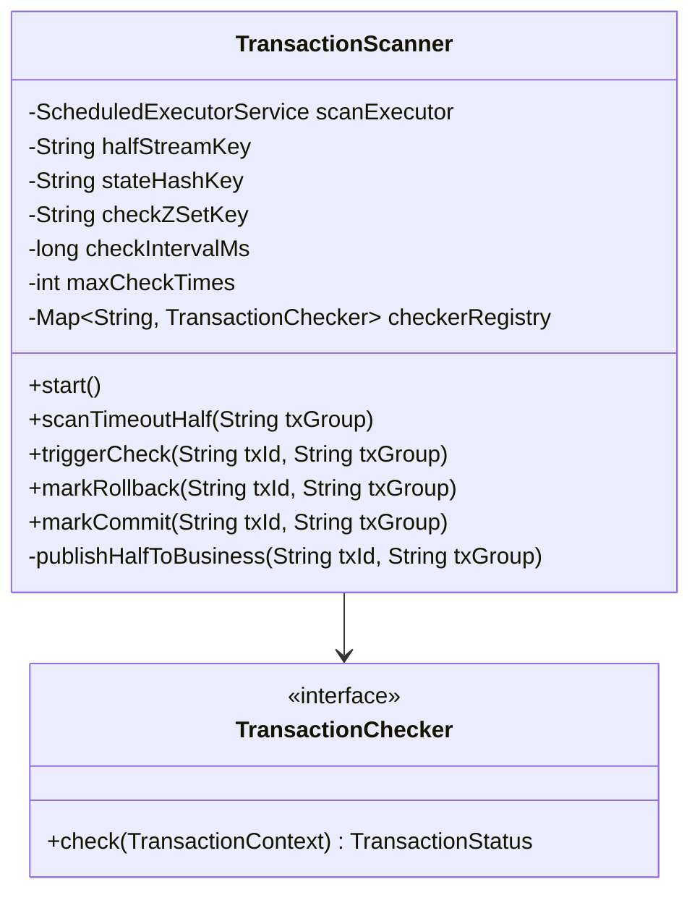
```mermaid
classDiagram
    class TransactionScanner {
        -ScheduledExecutorService scanExecutor
        -String halfStreamKey
        -String stateHashKey
        -String checkZSetKey
        -long checkIntervalMs
        -int maxCheckTimes
        -Map~String, TransactionChecker~ checkerRegistry
        +start()
        +scanTimeoutHalf(String txGroup)
        +triggerCheck(String txId, String txGroup)
        +markRollback(String txId, String txGroup)
        +markCommit(String txId, String txGroup)
        -publishHalfToBusiness(String txId, String txGroup)
    }
    class TransactionChecker {
        <<interface>>
        +check(TransactionContext) TransactionStatus
    }
    TransactionScanner --> TransactionChecker
```

**Redis Key 设计（D4）**：

| Key 模式 | 类型 | 用途 |
|---|---|---|
| `streammq:half:{txGroup}` | Stream | 半消息暂存（待 commit 后转投） |
| `streammq:txstate:{txGroup}` | Hash | field=txId, value=PREPARE/COMMIT/ROLLBACK/UNKNOWN |
| `streammq:txcheck:{txGroup}` | ZSet | score=checkTimeMillis，待回查 |

**关键方法伪代码**：

```java
public void start() {
    scanExecutor.scheduleAtFixedRate(() -> {
        for (String txGroup : checkerRegistry.keySet()) {
            scanTimeoutHalf(txGroup);
        }
    }, 0, 60, TimeUnit.SECONDS);  // 每 60s 扫描一次
}

private void scanTimeoutHalf(String txGroup) {
    String checkKey = String.format("streammq:txcheck:%s", txGroup);
    String stateKey = String.format("streammq:txstate:%s", txGroup);
    long now = System.currentTimeMillis();
    RScoredSortedSet<String> zset = redisson.getScoredSortedSet(checkKey);
    // 取出 score <= now 的全部 entry（一次性最多 batchSize 个）
    Collection<String> timeoutTxIds = zset.valueRange(0, true, now, true, 0, batchSize - 1);
    for (String txId : timeoutTxIds) {
        try {
            triggerCheck(txId, txGroup);
        } catch (RuntimeException e) {
            logger.warn("tx check failed: txId={}", txId, e);
        }
    }
}

public void triggerCheck(String txId, String txGroup) {
    TransactionChecker checker = checkerRegistry.get(txGroup);
    if (checker == null) {
        markRollback(txId, txGroup);  // 找不到 checker 视为回查失败 → rollback
        return;
    }
    RMap<String, String> stateMap = redisson.getMap(stateHashKey);
    String currentState = stateMap.get(txId);
    if (!"PREPARE".equals(currentState) && !"UNKNOWN".equals(currentState)) {
        // 已终态，从 ZSet 移除
        redisson.getScoredSortedSet(checkKey).remove(txId);
        return;
    }
    // 调用 Checker
    TransactionContext ctx = new TransactionContext(txId, txGroup);
    TransactionStatus status = checker.check(ctx);
    int retryCount = getCheckRetryCount(txId);
    switch (status) {
        case COMMIT -> {
            stateMap.put(txId, "COMMIT");
            publishHalfToBusiness(txId, txGroup);
            removeCheck(txId);
        }
        case ROLLBACK -> {
            stateMap.put(txId, "ROLLBACK");
            removeCheck(txId);
        }
        case UNKNOWN -> {
            stateMap.put(txId, "UNKNOWN");
            if (retryCount >= maxCheckTimes) {
                // 连续 N 次仍 UNKNOWN → 强制 ROLLBACK
                markRollback(txId, txGroup);
            } else {
                // 重新放入 ZSet，score = now + checkInterval
                reschedule(txId, System.currentTimeMillis() + checkIntervalMs);
            }
        }
    }
}

public void markRollback(String txId, String txGroup) {
    String stateKey = String.format("streammq:txstate:%s", txGroup);
    redisson.getMap(stateKey).put(txId, "ROLLBACK");
    String checkKey = String.format("streammq:txcheck:%s", txGroup);
    redisson.getScoredSortedSet(checkKey).remove(txId);
    // 半消息从 half stream 删除（XDEL）
    String halfKey = String.format("streammq:half:%s", txGroup);
    redisson.getStream(halfKey).remove(getHalfMessageId(txId));
}
```

### 3.8 DelayMessageScheduler

**职责**：扫描各延时级别的 ZSet，将到期消息转投到目标 Stream。

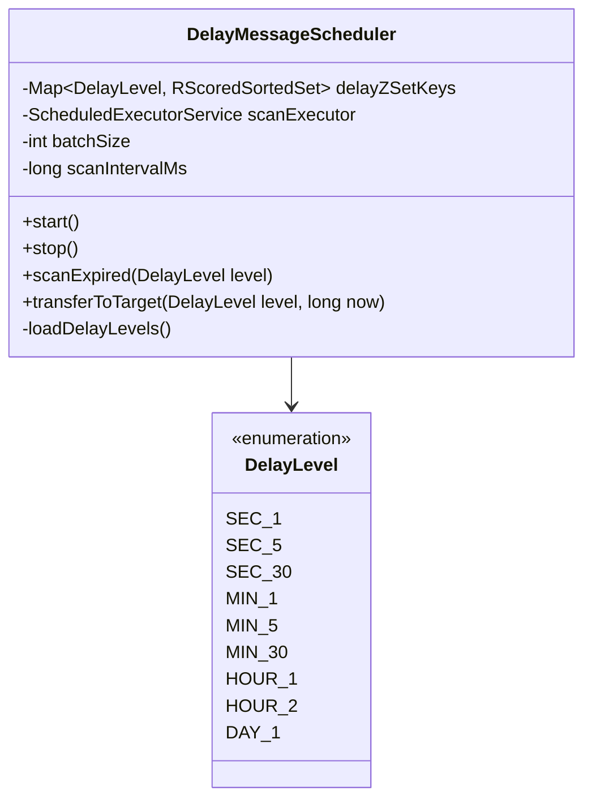
```mermaid
classDiagram
    class DelayMessageScheduler {
        -Map~DelayLevel, RScoredSortedSet~ delayZSetKeys
        -ScheduledExecutorService scanExecutor
        -int batchSize
        -long scanIntervalMs
        +start()
        +stop()
        +scanExpired(DelayLevel level)
        +transferToTarget(DelayLevel level, long now)
        -loadDelayLevels()
    }
    class DelayLevel {
        <<enumeration>>
        SEC_1
        SEC_5
        SEC_30
        MIN_1
        MIN_5
        MIN_30
        HOUR_1
        HOUR_2
        DAY_1
    }
    DelayMessageScheduler --> DelayLevel
```

**关键方法伪代码**：

```java
public void start() {
    // 初始化各 level 的 ZSet
    for (DelayLevel level : DelayLevel.values()) {
        String key = String.format("streammq:delay:%s", level.name());
        delayZSetKeys.put(level, redisson.getScoredSortedSet(key));
    }
    // 周期扫描（1s 一次）
    scanExecutor.scheduleAtFixedRate(() -> {
        for (DelayLevel level : DelayLevel.values()) {
            scanExpired(level);
        }
    }, 0, scanIntervalMs, TimeUnit.MILLISECONDS);
}

private void scanExpired(DelayLevel level) {
    RScoredSortedSet<String> zset = delayZSetKeys.get(level);
    long now = System.currentTimeMillis();
    // Lua 原子转移（与 RetryScheduler 共用脚本，DLQ 参数为占位）
    Collection<String> expired = zset.valueRange(0, true, now, true, 0, batchSize - 1);
    if (expired.isEmpty()) return;
    RBatch batch = redisson.createBatch();
    for (String member : expired) {
        DelayEntry entry = parse(member);
        batch.getStream(entry.getTargetStream())
            .add(entry.toFields(), StreamAddArgs.maxLen(maxLen).approximateTrimming());
        batch.getScoredSortedSet(zset.getName()).removeAsync(member);
    }
    batch.execute();
}
```

### 3.9 ListenerContainer 的虚拟线程模型

**分层模型**：

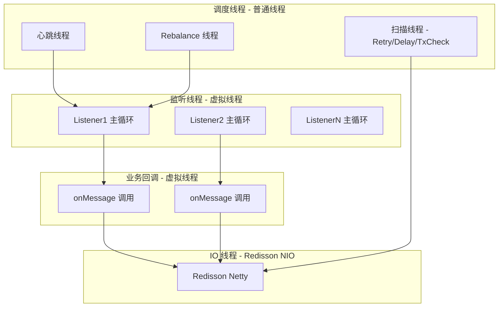
```mermaid
graph TB
    subgraph 调度层[调度线程 - 普通线程]
        HB[心跳线程]
        RB[Rebalance 线程]
        SC[扫描线程 - Retry/Delay/TxCheck]
    end
    subgraph 监听层[监听线程 - 虚拟线程]
        L1[Listener1 主循环]
        L2[Listener2 主循环]
        LN[ListenerN 主循环]
    end
    subgraph 业务层[业务回调 - 虚拟线程]
        B1[onMessage 调用]
        B2[onMessage 调用]
    end
    subgraph IO层[IO 线程 - Redisson NIO]
        IO1[Redisson Netty]
    end
    HB --> L1
    RB --> L1
    L1 --> B1
    B1 --> IO1
    L2 --> B2
    B2 --> IO1
    SC --> IO1
```

**ThreadFactory 创建方式**：

```java
// 虚拟线程 Factory（监听线程）
private static final ThreadFactory VIRTUAL_THREAD_FACTORY =
    Thread.ofVirtual().name("streammq-consumer-", 0).factory();

// 监听线程池：虚拟线程载体（每任务一线程，无界）
private final ExecutorService listenerThreads =
    Executors.newThreadPerTaskExecutor(VIRTUAL_THREAD_FACTORY);

// 调度线程池：普通线程（核心数 = 4，足够）
private final ScheduledExecutorService scheduledExecutor =
    Executors.newScheduledThreadPool(4,
        new ThreadFactoryBuilder().setNameFormat("streammq-sched-%d").build());
```

**异常隔离机制**：

```java
// 虚拟线程未捕获异常处理器
Thread.currentThread().setUncaughtExceptionHandler((t, e) -> {
    logger.error("virtual thread uncaught exception: {}", t.getName(), e);
    metrics.counter("streammq.consumer.uncaught.exception").increment();
    // 不传播到其他虚拟线程（虚拟线程天然隔离）
});

// Listener 异常隔离（在 onMessage 调用处捕获 RuntimeException）
try {
    action = listener.onMessage(message, ctx);
} catch (RuntimeException e) {
    logger.warn("listener exception: {}", listenerName, e);
    action = Action.RECONSUME_LATER;  // 不影响其他消息消费
}
```

---

## 4. 关键算法伪代码

### 4.1 发送消息流程

```java
/**
 * syncSend / asyncSend / sendOneway 三种语义统一入口
 */
public SendResult send(Message<T> message, SendSemantic semantic) {
    long start = System.nanoTime();
    SendResult result = null;
    boolean success = false;
    try {
        // 1. ProducerInterceptor.beforeSend（链式，可短路）
        for (ProducerInterceptor interceptor : interceptors) {
            message = interceptor.beforeSend(message);
            if (message == null) {
                throw new StreamMqException("interceptor returned null message");
            }
        }
        // 2. 序列化 payload
        byte[] body = serializer.serialize(message.getPayload());
        // 3. 构造 Stream Entry（headers + body + messageId + timestamp）
        Map<String, byte[]> entry = new HashMap<>();
        entry.put("body", body);
        entry.put("messageId", message.getMessageId().getBytes());
        entry.put("topic", message.getTopic().getBytes());
        entry.put("tags", message.getTags().getBytes());
        entry.put("timestamp", String.valueOf(System.currentTimeMillis()).getBytes());
        if (message.getDelayLevel() != null) {
            entry.put("delayLevel", message.getDelayLevel().name().getBytes());
        }
        // 4. 按语义分发
        RedissonStreamProducer producer = producerFactory.create(message.getGroup());
        switch (semantic) {
            case SYNC -> result = producer.doSyncSend(entry, message);
            case ASYNC -> {
                producer.doAsyncSend(entry, message, message.getSendCallback());
                result = SendResult.pending();
            }
            case ONEWAY -> {
                producer.doSendOneway(entry, message);
                result = SendResult.oneway();
            }
        }
        // 5. ProducerInterceptor.afterSend
        for (ProducerInterceptor interceptor : interceptors) {
            interceptor.afterSend(message, result);
        }
        success = true;
        return result;
    } catch (SerializationException e) {
        // 序列化失败不可重试
        throw e;
    } catch (RuntimeException e) {
        // 发送失败按 RetryPolicy 重试
        if (retryPolicy.canRetry()) {
            return retrySend(message, semantic);
        }
        throw new StreamMqBrokerException("send failed", e);
    } finally {
        recordMetrics("send." + (success ? "success" : "fail"),
            System.nanoTime() - start, success);
    }
}
```

### 4.2 消费消息流程

```java
/**
 * 消费主循环（虚拟线程上运行）
 */
public void consumeLoop() {
    RStream<String, byte[]> stream = redisson.getStream(streamKey);
    while (container.isRunning()) {
        // 1. XREADGROUP BLOCK + COUNT
        Map<StreamMessageId, Map<String, byte[]>> messages;
        try {
            messages = stream.readGroup(groupName, consumerName,
                StreamReadGroupArgs.greaterThan(lastConsumedId)
                    .timeout(Duration.ofMillis(blockMillis))
                    .count(batchSize));
        } catch (RedisException e) {
            // Redis 不可达 → 退避
            backoffAndWait();
            continue;
        }
        if (messages == null || messages.isEmpty()) continue;

        // 2. 逐条处理
        for (var entry : messages.entrySet()) {
            StreamMessageId id = entry.getKey();
            Map<String, byte[]> fields = entry.getValue();
            try {
                processMessage(id, fields);
            } catch (RuntimeException e) {
                logger.warn("consume error: id={}", id, e);
                // 进入重试队列
                enqueueRetry(id, fields, e);
            }
        }
    }
}

private void processMessage(StreamMessageId id, Map<String, byte[]> fields) {
    // 1. 反序列化
    Message<?> message = messageConverter.fromStreamEntry(fields);
    // 2. ConsumerInterceptor.beforeConsume
    for (ConsumerInterceptor ci : interceptors) {
        ci.beforeConsume(message);
    }
    // 3. 调用 Listener
    ConsumerContext ctx = new ConsumerContext(groupName, topic, id);
    Action action;
    try {
        action = listener.onMessage(message, ctx);
    } catch (RuntimeException e) {
        // 异常兜底：视为 RECONSUME_LATER
        action = Action.RECONSUME_LATER;
        logger.warn("listener threw exception: {}", e.getMessage(), e);
    }
    // 4. 按 Action 处理
    switch (action) {
        case SUCCESS:
            stream.ack(groupName, id);
            metrics.counter("streammq.consumer.consume.success").increment();
            break;
        case RECONSUME_LATER:
            enqueueRetry(id, fields, null);
            // 不 ack，让 PEL 暂留；扫描线程会清理
            metrics.counter("streammq.consumer.consume.retry").increment();
            break;
        case DEFER:
            // 推迟 N 秒重新可见（写入延时 ZSet）
            long deferTs = System.currentTimeMillis() + ctx.getDeferMillis();
            redisson.getScoredSortedSet(deferKey).add(deferTs,
                buildDeferEntry(id, fields));
            break;
    }
    // 5. ConsumerInterceptor.afterConsume
    for (ConsumerInterceptor ci : interceptors) {
        ci.afterConsume(message, action);
    }
}

private void enqueueRetry(StreamMessageId id, Map<String, byte[]> fields, Throwable cause) {
    int retryCount = parseRetryCount(fields) + 1;
    long nextRetryAt = retryPolicy.nextRetryAt(System.currentTimeMillis(), retryCount);
    RetryEntry entry = new RetryEntry(id, fields, retryCount, cause);
    redisson.getScoredSortedSet(retryKey).add(nextRetryAt, entry.toJson());
}
```

### 4.3 Rebalance 算法

```java
/**
 * Rebalance 主流程（D3：Gossip + RSemaphore AP 风格）
 */
public void scheduleRebalance() {
    // 1. 上报心跳（最近活跃时间写入 instances Hash）
    groupManager.heartbeat();

    // 2. 收集活跃 Consumer 列表（剔除超时实例）
    List<String> activeInstances = groupManager.getActiveConsumers();
    if (activeInstances.isEmpty()) {
        logger.warn("no active consumer in group={}", groupName);
        return;
    }

    // 3. 调用 RebalanceStrategy 计算分配
    //    默认 ConsistentHash，也可配置 Average / Range
    Map<String, List<Integer>> assignment =
        rebalanceStrategy.assign(activeInstances, shardCount);

    // 4. 写入 assignment Hash（RSemaphore 仲裁，最终一致）
    Map<String, String> assignmentCsv = assignment.entrySet().stream()
        .collect(Collectors.toMap(
            Map.Entry::getKey,
            e -> e.getValue().stream().map(String::valueOf)
                .collect(Collectors.joining(","))
        ));
    RMap<String, String> assignMap = redisson.getMap(assignmentHashKey);
    assignMap.putAll(assignmentCsv);

    // 5. 广播 REBALANCE 通知（RTopic）
    redisson.getTopic(notifyTopicKey).publish("REBALANCE");

    // 6. 当前实例收到通知后重启监听
    //    （RTopic 监听器内调用 onRebalanceNotify）
    onRebalanceNotify(assignment.get(instanceId));
}

private void onRebalanceNotify(List<Integer> assignedShards) {
    // 1. 停掉不再归属本实例的 shard 监听
    for (ListenerContext ctx : listeners.values()) {
        if (ctx.getShardId() != null &&
            !assignedShards.contains(ctx.getShardId())) {
            ctx.stop();
        }
    }
    // 2. 启动新归属的 shard 监听
    for (Integer shardId : assignedShards) {
        String shardStream = String.format("%s:shard%d", streamKey, shardId);
        if (!isListening(shardStream)) {
            startListener(shardStream);
        }
    }
}

/**
 * ConsistentHash 分配算法（默认实现）
 */
public class ConsistentHashStrategy implements RebalanceStrategy {
    @Override
    public Map<String, List<Integer>> assign(List<String> instances, int shardCount) {
        // 1. 构建 Hash 环（每个实例虚拟节点 150）
        SortedMap<Long, String> ring = new TreeMap<>();
        for (String inst : instances) {
            for (int i = 0; i < 150; i++) {
                long h = hash(inst + ":" + i);
                ring.put(h, inst);
            }
        }
        // 2. 每个 shard 路由到环上第一个实例
        Map<String, List<Integer>> result = new HashMap<>();
        for (String inst : instances) result.put(inst, new ArrayList<>());
        for (int shard = 0; shard < shardCount; shard++) {
            long h = hash("shard:" + shard);
            SortedMap<Long, String> tail = ring.tailMap(h);
            String owner = tail.isEmpty() ? ring.get(ring.firstKey()) : tail.get(tail.firstKey());
            result.get(owner).add(shard);
        }
        return result;
    }
}
```

### 4.4 事务消息流程

```java
/**
 * 事务消息发送（半消息 → 本地事务 → 状态写入）
 */
public <R> SendResult executeInTransaction(LocalTransactionExecutor<R> executor) {
    String txId = UUID.randomUUID().toString();
    String txGroup = properties.getTransaction().getDefaultGroup();
    long now = System.currentTimeMillis();

    // 1. 半消息发送（写入 half stream，状态 PREPARE）
    Map<String, byte[]> halfEntry = buildHalfEntry(txId, txGroup, executor.getMessage());
    RStream<String, byte[]> halfStream = redisson.getStream(
        String.format("streammq:half:%s", txGroup));
    StreamMessageId halfId = halfStream.add(halfEntry);

    // 2. 写入状态 Hash：state=PREPARE
    RMap<String, String> stateMap = redisson.getMap(
        String.format("streammq:txstate:%s", txGroup));
    stateMap.put(txId, "PREPARE");

    // 3. 注册回查任务（ZSet score = now + checkInterval）
    RScoredSortedSet<String> checkZSet = redisson.getScoredSortedSet(
        String.format("streammq:txcheck:%s", txGroup));
    long firstCheckAt = now + properties.getTransaction().getCheckIntervalSeconds() * 1000L;
    checkZSet.add(firstCheckAt, txId);

    // 4. 执行本地事务
    try {
        TransactionStatus status = executor.execute();
        // 5. 根据状态更新
        if (status == TransactionStatus.COMMIT) {
            stateMap.put(txId, "COMMIT");
            publishHalfToBusiness(txId, txGroup, halfId);
        } else {
            // ROLLBACK
            stateMap.put(txId, "ROLLBACK");
            halfStream.remove(halfId);
            checkZSet.remove(txId);
        }
        return new SendResult(halfId.toString(), SendStatus.SEND_OK, txId);
    } catch (RuntimeException e) {
        // 本地事务异常 → ROLLBACK
        stateMap.put(txId, "ROLLBACK");
        halfStream.remove(halfId);
        checkZSet.remove(txId);
        throw new StreamMqTransactionException("local tx failed", e);
    }
}

/**
 * 半消息转投到业务 Stream（commit 时调用）
 */
private void publishHalfToBusiness(String txId, String txGroup, StreamMessageId halfId) {
    RStream<String, byte[]> halfStream = redisson.getStream(
        String.format("streammq:half:%s", txGroup));
    Map<String, byte[]> fields = halfStream.read(halfId).get(halfId);
    // XADD 到业务 Stream
    String businessStream = String.format("streammq:msg:%s",
        new String(fields.get("topic")));
    redisson.getStream(businessStream).add(fields);
    // XDEL 半消息
    halfStream.remove(halfId);
}

/**
 * 回查触发（扫描线程调用）
 */
public void triggerCheck(String txId, String txGroup) {
    TransactionChecker checker = checkerRegistry.get(txGroup);
    if (checker == null) {
        markRollback(txId, txGroup);
        return;
    }
    TransactionContext ctx = new TransactionContext(txId, txGroup);
    TransactionStatus status = checker.check(ctx);
    switch (status) {
        case COMMIT -> markCommit(txId, txGroup);
        case ROLLBACK -> markRollback(txId, txGroup);
        case UNKNOWN -> {
            // 重新放入 ZSet 等下次回查
            long nextCheckAt = System.currentTimeMillis()
                + properties.getTransaction().getCheckIntervalSeconds() * 1000L;
            redisson.getScoredSortedSet(
                String.format("streammq:txcheck:%s", txGroup))
                .add(nextCheckAt, txId);
            // 连续 N 次仍 UNKNOWN → 强制 ROLLBACK
            if (incrementCheckCount(txId) >= maxCheckTimes) {
                markRollback(txId, txGroup);
            }
        }
    }
}
```

### 4.5 延时消息流程

```java
/**
 * 延时消息发送（写入 ZSet，score = 触发时间）
 */
public SendResult sendDelay(Message<?> message, DelayLevel level) {
    long deliverAt = System.currentTimeMillis() + level.getDelayMillis();
    DelayEntry entry = new DelayEntry(
        message.getMessageId(),
        message.getTopic(),
        messageConverter.toStreamEntry(message)
    );
    String zsetKey = String.format("streammq:delay:%s", level.name());
    redisson.getScoredSortedSet(zsetKey).add(deliverAt, entry.toJson());
    return SendResult.delayed(deliverAt);
}

/**
 * 后台扫描转投（每 1s 一次）
 */
private void scanExpired(DelayLevel level) {
    String zsetKey = String.format("streammq:delay:%s", level.name());
    RScoredSortedSet<String> zset = redisson.getScoredSortedSet(zsetKey);
    long now = System.currentTimeMillis();
    Collection<String> expired = zset.valueRange(0, true, now, true, 0, batchSize - 1);
    if (expired.isEmpty()) return;
    // Lua 原子：ZRANGEBYSCORE + XADD + ZREM
    for (String member : expired) {
        DelayEntry entry = DelayEntry.fromJson(member);
        String targetStream = String.format("streammq:msg:%s", entry.getTopic());
        redisson.getStream(targetStream).add(entry.toFields());
        zset.remove(member);
    }
}
```

### 4.6 重试与 DLQ 流程

```java
/**
 * 重试扫描入口（每 1s 一次）
 */
private void scanRetryEntries(String topic, String group) {
    String retryKey = String.format("streammq:retry:%s:%s", topic, group);
    String targetStream = String.format("streammq:msg:%s", topic);
    String dlqStream = String.format("streammq:dlq:%s:%s", topic, group);
    long now = System.currentTimeMillis();
    try {
        // 调用 Lua 脚本（见 3.6）
        Long transferred = luaScript.eval(
            RScript.ScriptReturnType.INTEGER,
            List.of(retryKey, targetStream, dlqStream),
            now, batchSize, maxReconsumeTimes);
        metrics.counter("streammq.retry.transferred").increment(transferred);
    } catch (RedisException e) {
        logger.warn("lua retry transfer failed, fallback to split ops", e);
        // 降级：ZPOPMIN + XADD 拆分（带分布式锁）
        fallbackSplitTransfer(retryKey, targetStream, dlqStream, now);
    }
}

/**
 * 降级方案（Lua 失败时）：ZPOPMIN + XADD 拆分 + 分布式锁
 */
private void fallbackSplitTransfer(String retryKey, String targetStream,
                                     String dlqStream, long now) {
    RLock lock = redisson.getLock(retryKey + ":transfer:lock");
    try {
        if (!lock.tryLock(5, 30, TimeUnit.SECONDS)) return;
        RScoredSortedSet<String> zset = redisson.getScoredSortedSet(retryKey);
        for (int i = 0; i < batchSize; i++) {
            Collection<ScoredEntry<String>> entries =
                zset.entryRange(0, 0);  // 取最小 score
            if (entries.isEmpty()) break;
            ScoredEntry<String> e = entries.iterator().next();
            if (e.getScore() > now) break;  // 未到期
            zset.remove(e.getValue());
            RetryEntry entry = RetryEntry.fromJson(e.getValue());
            if (entry.getRetryCount() >= maxReconsumeTimes) {
                redisson.getStream(dlqStream).add(
                    Map.of("body", entry.getFields().get("body"),
                           "reason", "maxRetry".getBytes()));
            } else {
                redisson.getStream(targetStream).add(entry.getFields());
            }
        }
    } finally {
        if (lock.isHeldByCurrentThread()) lock.unlock();
    }
}
```

### 4.7 顺序消费流程

```java
/**
 * 顺序消费主循环（D6：shard 级 RLock）
 */
public void orderlyConsumeLoop(int shardId) {
    String shardStream = String.format("%s:shard%d", streamKey, shardId);
    String lockKey = String.format("streammq:shardlock:%s:%s:%d",
        topic, groupName, shardId);
    RLock lock = redisson.getLock(lockKey);

    while (container.isRunning()) {
        // 1. 获取 shard 锁（超时 5s）
        boolean locked;
        try {
            locked = lock.tryLock(5, 30, TimeUnit.SECONDS);
        } catch (InterruptedException e) {
            Thread.currentThread().interrupt();
            break;
        }
        if (!locked) {
            // 锁失败 → 跳过本 shard 等下次轮询
            sleep(pollIntervalMs);
            continue;
        }
        try {
            // 2. 串行消费 shard 内消息
            consumeShard(shardStream);
        } finally {
            // 3. unlock（watchdog 自动续期）
            if (lock.isHeldByCurrentThread()) {
                lock.unlock();
            }
        }
    }
}

private void consumeShard(String shardStream) {
    RStream<String, byte[]> stream = redisson.getStream(shardStream);
    while (container.isRunning()) {
        Map<StreamMessageId, Map<String, byte[]>> messages = stream.readGroup(
            groupName, consumerName,
            StreamReadGroupArgs.greaterThan(lastConsumedId)
                .timeout(Duration.ofMillis(blockMillis))
                .count(1));  // 顺序消费每次 1 条
        if (messages == null || messages.isEmpty()) break;
        for (var entry : messages.entrySet()) {
            // 串行调用 Listener（同 shard 内顺序保证）
            processMessage(entry.getKey(), entry.getValue());
            lastConsumedId = entry.getKey();
        }
    }
}
```

### 4.8 批量发送流程

```java
/**
 * 批量发送（RBatch + fail-strategy）
 */
public List<SendResult> syncSendBatch(List<Message<?>> messages) {
    // 1. 序列化所有消息
    List<Map<String, byte[]>> entries = messages.stream()
        .map(messageConverter::toStreamEntry)
        .toList();

    // 2. 构造 RBatch
    RBatch batch = redisson.createBatch();
    for (Map<String, byte[]> entry : entries) {
        batch.getStream(streamKey).add(entry,
            StreamAddArgs.maxLen(maxLen).approximateTrimming());
    }

    // 3. 执行
    BatchResult<?> result;
    try {
        result = batch.execute();
    } catch (RedisException e) {
        if (failStrategy == FailStrategy.ALL_OR_NOTHING) {
            throw new StreamMqBrokerException("batch send all failed", e);
        }
        // PARTIAL_SUCCESS：逐条重试
        return retryEachMessage(messages);
    }

    // 4. 解析结果
    List<SendResult> sendResults = new ArrayList<>(entries.size());
    List<?> responses = result.getResponses();
    for (int i = 0; i < entries.size(); i++) {
        Object resp = responses.get(i);
        if (resp instanceof StreamMessageId id) {
            sendResults.add(new SendResult(id.toString(),
                SendStatus.SEND_OK, messages.get(i).getMessageId()));
        } else {
            sendResults.add(new SendResult(null,
                SendStatus.FAIL, messages.get(i).getMessageId()));
        }
    }
    return sendResults;
}

private List<SendResult> retryEachMessage(List<Message<?>> messages) {
    List<SendResult> results = new ArrayList<>();
    for (Message<?> msg : messages) {
        try {
            results.add(syncSend(msg));
        } catch (RuntimeException e) {
            results.add(new SendResult(null, SendStatus.FAIL, msg.getMessageId()));
        }
    }
    return results;
}
```

---

## 5. 线程模型与并发控制

### 5.1 线程池分层图

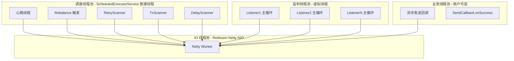
```mermaid
graph TB
    subgraph 调度线程池[调度线程池 - ScheduledExecutorService 普通线程]
        direction LR
        S1[心跳线程]
        S2[Rebalance 触发]
        S3[RetryScanner]
        S4[TxScanner]
        S5[DelayScanner]
    end
    subgraph 监听线程池[监听线程池 - 虚拟线程]
        direction LR
        L1[Listener1 主循环]
        L2[Listener2 主循环]
        L3[ListenerN 主循环]
    end
    subgraph 业务线程池[业务线程池 - 用户可选]
        B1[异步发送回调]
        B2[SendCallback.onSuccess]
    end
    subgraph IO线程池[IO 线程池 - Redisson Netty NIO]
        IO1[Netty Worker]
    end
    S1 --> IO1
    S2 --> IO1
    S3 --> IO1
    S4 --> IO1
    S5 --> IO1
    L1 --> IO1
    L2 --> IO1
    L3 --> IO1
    B1 --> IO1
```

| 线程池 | 类型 | 核心 / 最大 | 用途 | 阻塞特性 |
|---|---|---|---|---|
| 调度线程池 | `ScheduledExecutorService` | 4 / 4 | 心跳、Rebalance、扫描 | 短任务，不阻塞 |
| 监听线程池 | 虚拟线程（newThreadPerTaskExecutor） | 无界 | 消息消费回调 | 长任务，IO 密集 |
| 业务线程池 | `ExecutorService`（用户提供） | 用户配置 | 异步发送回调 | 短任务 |
| IO 线程池 | Redisson Netty | 32 (默认) | Redis 命令 NIO | 非阻塞 |

### 5.2 虚拟线程使用规范

**何时使用虚拟线程**：

| 场景 | 是否虚拟线程 | 理由 |
|---|---|---|
| 消费回调（onMessage） | ✅ | IO 密集，长任务，高并发 |
| 异步发送回调 | ✅ | 短任务，但需大量并发 |
| Listener 主循环 | ✅ | BLOCK 读取会阻塞，虚拟线程不阻塞载体 |
| 心跳、扫描、Rebalance | ❌ | 短任务，低并发，普通线程足够 |
| Lua 脚本执行 | ❌ | Redisson NIO 内部完成 |

**ThreadFactory 创建**：

```java
// 虚拟线程 Factory
ThreadFactory virtualFactory =
    Thread.ofVirtual().name("streammq-consumer-", 0).factory();

// 监听线程池：每任务一线程，无界
ExecutorService listenerThreads =
    Executors.newThreadPerTaskExecutor(virtualFactory);

// 调度线程池：普通线程，命名
ThreadFactory schedFactory =
    Thread.ofPlatform().name("streammq-sched-", 0).factory();
ScheduledExecutorService scheduledExecutor =
    Executors.newScheduledThreadPool(4, schedFactory);
```

**注意事项**：

- 虚拟线程不适合 CPU 密集任务（无法利用多核优势）
- 虚拟线程不要 `pin`（避免在 synchronized 块内 IO，使用 ReentrantLock）
- 虚拟线程无界，必须配合背压（ListenerContainer 内部队列上限）

### 5.3 并发同步机制

**ListenerContainer 内部状态机**：

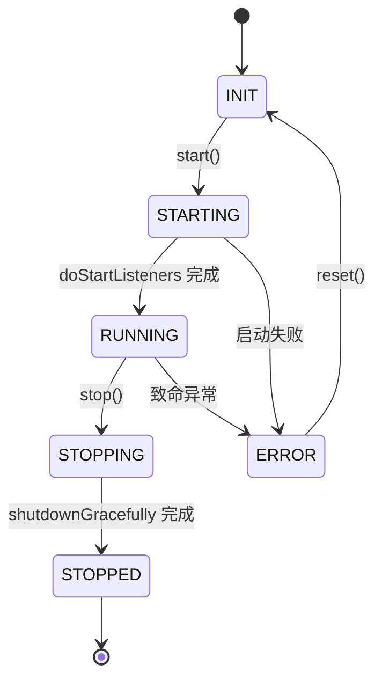
```mermaid
stateDiagram-v2
    [*] --> INIT
    INIT --> STARTING: start()
    STARTING --> RUNNING: doStartListeners 完成
    RUNNING --> STOPPING: stop()
    STOPPING --> STOPPED: shutdownGracefully 完成
    RUNNING --> ERROR: 致命异常
    STARTING --> ERROR: 启动失败
    ERROR --> INIT: reset()
    STOPPED --> [*]
```

**状态转换 CAS**：

```java
public class StreamMqListenerContainer {
    private final AtomicReference<LifecycleState> state =
        new AtomicReference<>(LifecycleState.INIT);

    public void start() {
        if (!state.compareAndSet(LifecycleState.INIT, LifecycleState.STARTING)) {
            throw new IllegalStateException("cannot start from " + state.get());
        }
        try {
            doStartListeners();
            state.set(LifecycleState.RUNNING);
        } catch (RuntimeException e) {
            state.set(LifecycleState.ERROR);
            throw e;
        }
    }

    public void stop() {
        if (!state.compareAndSet(LifecycleState.RUNNING, LifecycleState.STOPPING)) {
            return;  // 已停或正在停
        }
        shutdownGracefully(properties.getShutdownTimeoutSeconds() * 1000L);
        state.set(LifecycleState.STOPPED);
    }
}
```

**Listener 注册表**：

```java
// 线程安全：ConcurrentHashMap
private final ConcurrentHashMap<String, ListenerContext> listeners =
    new ConcurrentHashMap<>();

public void registerListener(StreamMqListener<?> listener, StreamMqListenerAnnotation ann) {
    String key = ann.group() + ":" + ann.topic();
    ListenerContext ctx = new ListenerContext(listener, ann);
    ListenerContext prev = listeners.putIfAbsent(key, ctx);
    if (prev != null) {
        throw new StreamMqException("duplicate listener for " + key);
    }
}
```

**关闭流程**：

```java
private void shutdownGracefully(long timeoutMs) {
    long deadline = System.currentTimeMillis() + timeoutMs;
    // 1. 停止接收新消息
    for (ListenerContext ctx : listeners.values()) {
        ctx.stop();  // 让 poll 主循环退出
    }
    // 2. 等待在途消息处理完
    for (ListenerContext ctx : listeners.values()) {
        long remaining = deadline - System.currentTimeMillis();
        if (remaining <= 0) break;
        try {
            ctx.getPollFuture().get(remaining, TimeUnit.MILLISECONDS);
        } catch (TimeoutException | InterruptedException | ExecutionException e) {
            logger.warn("listener shutdown timeout: {}", ctx.getListenerName());
            ctx.getPollFuture().cancel(true);
        }
    }
    // 3. 等待线程池关闭
    listenerThreads.shutdown();
    try {
        if (!listenerThreads.awaitTermination(
            deadline - System.currentTimeMillis(), TimeUnit.MILLISECONDS)) {
            listenerThreads.shutdownNow();
        }
    } catch (InterruptedException e) {
        Thread.currentThread().interrupt();
        listenerThreads.shutdownNow();
    }
}
```

### 5.4 线程异常处理

**虚拟线程未捕获异常处理器**：

```java
// 全局默认处理器
Thread.setDefaultUncaughtExceptionHandler((t, e) -> {
    logger.error("[StreamMQ] uncaught exception in thread {}", t.getName(), e);
    metrics.counter("streammq.thread.uncaught.exception",
        "type", e.getClass().getSimpleName()).increment();
});

// 虚拟线程 Factory 自定义
ThreadFactory virtualFactory = Thread.ofVirtual()
    .name("streammq-consumer-", 0)
    .uncaughtExceptionHandler((t, e) -> {
        logger.error("consumer virtual thread exception: {}", t.getName(), e);
        // 不传播到其他虚拟线程
    })
    .factory();
```

**Listener 异常隔离**：

```java
// onMessage 调用包裹 try-catch
try {
    action = listener.onMessage(message, ctx);
} catch (RuntimeException e) {
    logger.warn("listener exception, will retry: {}", e.getMessage());
    action = Action.RECONSUME_LATER;
    metrics.counter("streammq.listener.exception").increment();
}
// 单个 Listener 异常不影响其他 Listener 与其他消息
```

**重试调度异常隔离**：

```java
scanExecutor.scheduleAtFixedRate(() -> {
    try {
        scanRetryEntries(topic, group);
    } catch (RuntimeException e) {
        logger.warn("retry scan failed: {}/{}", topic, group, e);
        // 不抛出，避免 ScheduledExecutorService 终止后续调度
    }
}, 0, scanIntervalMs, TimeUnit.MILLISECONDS);
```

---

## 6. Redis Key 操作全集

### 6.1 业务消息相关

| Key 模式 | Redis 类型 | 命令组合 | 用途 | 频率 | 备注 |
|---|---|---|---|---|---|
| `streammq:msg:{topic}` | Stream | XADD / XREADGROUP / XACK / XLEN / XINFO | 普通消息存储 | 极高（每条消息） | MAXLEN 截断 |
| `streammq:msg:{topic}:shard{shardId}` | Stream | XADD / XREADGROUP / XACK | 顺序消息分片 Stream | 高 | shard 数默认 16 |
| `streammq:msg:{topic}:group:{group}:pending` | (PEL 内置) | XPENDING / XCLAIM | 待 ACK 列表查询 | 中 | 由 PelClaimScheduler 扫描重投清理 |

### 6.2 消费者组相关

| Key 模式 | Redis 类型 | 命令组合 | 用途 | 频率 | 备注 |
|---|---|---|---|---|---|
| `streammq:cg:{group}:instances` | Hash | HSET / HGETALL / HDEL | 活跃 Consumer 实例 | 高（心跳周期写） | field=instanceId, value=lastHeartbeatTs |
| `streammq:cg:{group}:semaphore` | String（RSemaphore） | SET / INCR / DECR / EXPIRE | 跨节点活跃数仲裁 | 中 | 用于 Rebalance 防并发 |
| `streammq:cg:{group}:assignment` | Hash | HSET / HGETALL / HDEL | shard 分配结果 | 低（仅 Rebalance 时） | field=instanceId, value=shardIdList(CSV) |
| `streammq:cg:{group}:notify` | PubSub | PUBLISH / SUBSCRIBE | Rebalance 通知广播 | 低 | Topic 类型 |

### 6.3 重试与 DLQ

| Key 模式 | Redis 类型 | 命令组合 | 用途 | 频率 | 备注 |
|---|---|---|---|---|---|
| `streammq:retry:{topic}:{group}` | ZSet | ZADD / ZPOPMIN / ZRANGEBYSCORE / ZREM | 重试队列 | 高（每条重试） | score=nextRetryAt(ms) |
| `streammq:dlq:{topic}:{group}` | Stream | XADD / XRANGE / XLEN | 死信队列 | 中（达 maxRetry 时） | 死信消费走人工或独立 Listener |
| `streammq:retry:{topic}:{group}:transfer:lock` | String（RLock） | SET NX EX / DEL | 降级锁 | 低（仅 Lua 失败时） | 30s 过期 |

### 6.4 延时消息

| Key 模式 | Redis 类型 | 命令组合 | 用途 | 频率 | 备注 |
|---|---|---|---|---|---|
| `streammq:delay:{level}` | ZSet | ZADD / ZPOPMIN / ZRANGEBYSCORE / ZREM | 各延时级别队列 | 中（按延时消息量） | level ∈ {SEC_1, SEC_5, ..., DAY_1} |
| `streammq:delay:meta:delivered` | Hash | HINCRBY | 已投递计数 | 低 | 监控用 |

### 6.5 事务消息

| Key 模式 | Redis 类型 | 命令组合 | 用途 | 频率 | 备注 |
|---|---|---|---|---|---|
| `streammq:half:{txGroup}` | Stream | XADD / XREAD / XDEL | 半消息暂存 | 低（事务消息少） | commit 后 XADD 业务 Stream + XDEL |
| `streammq:txstate:{txGroup}` | Hash | HSET / HGET / HDEL | 事务状态 | 低 | field=txId, value=PREPARE/COMMIT/ROLLBACK/UNKNOWN |
| `streammq:txcheck:{txGroup}` | ZSet | ZADD / ZPOPMIN / ZRANGEBYSCORE / ZREM | 超时回查扫描 | 低 | score=checkTimeMillis |
| `streammq:txcheck:{txGroup}:counter` | Hash | HINCRBY / HGET | 回查次数计数 | 低 | field=txId, value=retryCount |

### 6.6 顺序消费

| Key 模式 | Redis 类型 | 命令组合 | 用途 | 频率 | 备注 |
|---|---|---|---|---|---|
| `streammq:shardlock:{topic}:{group}:{shardId}` | String（RLock） | SET NX PX / EXPIRE / DEL | shard 级顺序锁 | 高（每个 shard） | 30s 租约，watchdog 续期 |

### 6.7 运维

| Key 模式 | Redis 类型 | 命令组合 | 用途 | 频率 | 备注 |
|---|---|---|---|---|---|
| `streammq:meta:offset:{group}:{topic}` | String | SET / GET | 上次消费位点 | 低 | 用于重启后恢复 |
| `streammq:meta:counter:{group}:{topic}` | Hash | HINCRBY | 消费计数（成功 / 失败） | 中 | 监控统计 |
| `streammq:meta:stats:{group}:{topic}` | Hash | HSET / HGETALL | 运行时统计 | 低 | 用于 Actuator endpoint |

### 6.8 命令使用总览

| 命令 | 主要场景 | 频次（峰值） |
|---|---|---|
| XADD | 发送消息、重试转投、DLQ 写入 | 极高 |
| XREADGROUP | 消费消息主循环 | 极高 |
| XACK | 消费成功后确认 | 高 |
| XPENDING | PEL 查询（诊断 / 认领调度） | 低（周期） |
| XADD（PEL 重投） | 顺序消费崩溃残留重投（XADD 新 entry + XACK 旧 entry，保留 originalMessageId） | 低（周期） |
| ZADD | 重试 / 延时 / 回查入队 | 中 |
| ZPOPMIN | 重试 / 延时 / 回查出队 | 中 |
| HSET | 心跳 / 状态 / 分配写入 | 中 |
| HGETALL | 活跃 Consumer 列表 | 中（Rebalance 时） |
| SET NX PX | RLock 加锁 | 高（顺序消费） |
| PUBLISH | Rebalance 通知 | 低 |

---

## 7. 关键时序图

### 7.1 同步发送时序图

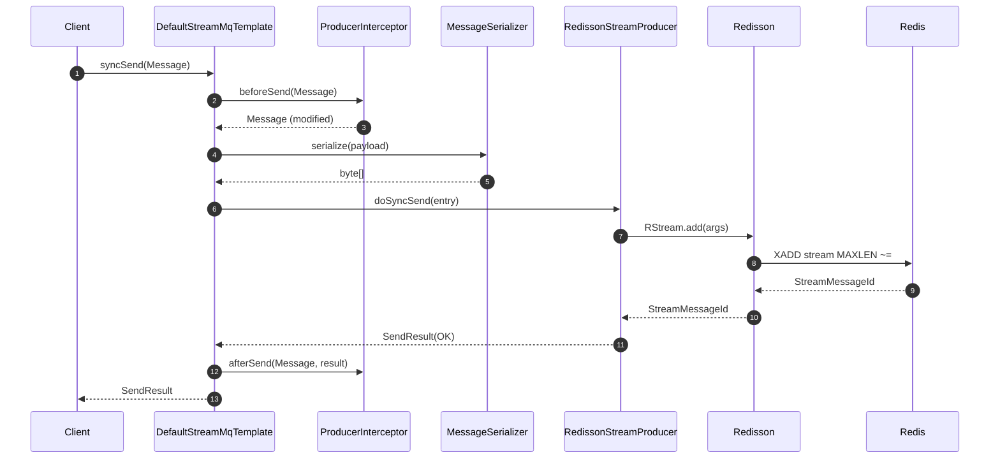
```mermaid
sequenceDiagram
    autonumber
    participant Client
    participant Template as DefaultStreamMqTemplate
    participant Interceptor as ProducerInterceptor
    participant Serializer as MessageSerializer
    participant Producer as RedissonStreamProducer
    participant Redisson
    participant Redis

    Client->>Template: syncSend(Message)
    Template->>Interceptor: beforeSend(Message)
    Interceptor-->>Template: Message (modified)
    Template->>Serializer: serialize(payload)
    Serializer-->>Template: byte[]
    Template->>Producer: doSyncSend(entry)
    Producer->>Redisson: RStream.add(args)
    Redisson->>Redis: XADD stream MAXLEN ~=
    Redis-->>Redisson: StreamMessageId
    Redisson-->>Producer: StreamMessageId
    Producer-->>Template: SendResult(OK)
    Template->>Interceptor: afterSend(Message, result)
    Template-->>Client: SendResult
```

### 7.2 消费消息时序图（自动 ACK）

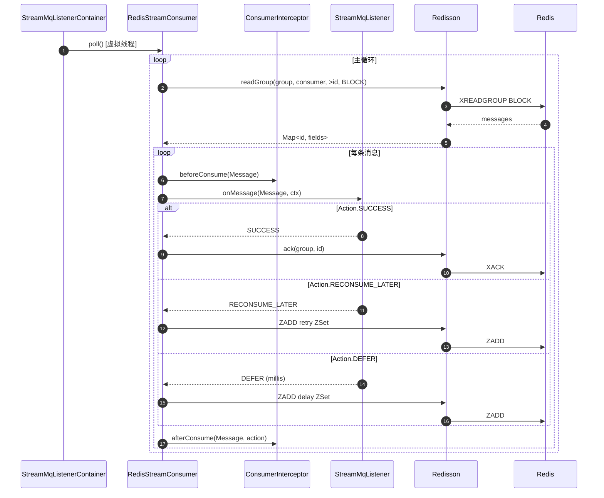
```mermaid
sequenceDiagram
    autonumber
    participant Container as StreamMqListenerContainer
    participant Consumer as RedisStreamConsumer
    participant Interceptor as ConsumerInterceptor
    participant Listener as StreamMqListener
    participant Redisson
    participant Redis

    Container->>Consumer: poll() [虚拟线程]
    loop 主循环
        Consumer->>Redisson: readGroup(group, consumer, >id, BLOCK)
        Redisson->>Redis: XREADGROUP BLOCK
        Redis-->>Redisson: messages
        Redisson-->>Consumer: Map<id, fields>
        loop 每条消息
            Consumer->>Interceptor: beforeConsume(Message)
            Consumer->>Listener: onMessage(Message, ctx)
            alt Action.SUCCESS
                Listener-->>Consumer: SUCCESS
                Consumer->>Redisson: ack(group, id)
                Redisson->>Redis: XACK
            else Action.RECONSUME_LATER
                Listener-->>Consumer: RECONSUME_LATER
                Consumer->>Redisson: ZADD retry ZSet
                Redisson->>Redis: ZADD
            else Action.DEFER
                Listener-->>Consumer: DEFER (millis)
                Consumer->>Redisson: ZADD delay ZSet
                Redisson->>Redis: ZADD
            end
            Consumer->>Interceptor: afterConsume(Message, action)
        end
    end
```

### 7.3 事务消息完整时序图

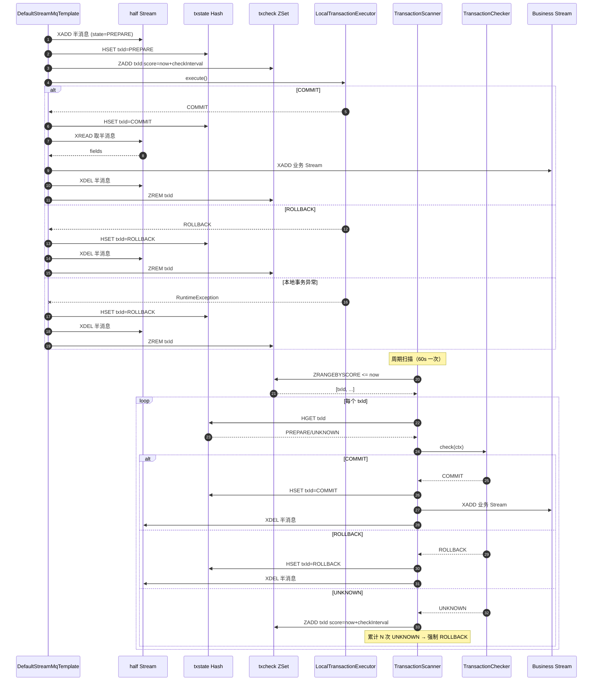
```mermaid
sequenceDiagram
    autonumber
    participant Producer as DefaultStreamMqTemplate
    participant HalfStream as half Stream
    participant StateHash as txstate Hash
    participant CheckZSet as txcheck ZSet
    participant Callback as LocalTransactionExecutor
    participant Scanner as TransactionScanner
    participant Checker as TransactionChecker
    participant Business as Business Stream

    Producer->>HalfStream: XADD 半消息 (state=PREPARE)
    Producer->>StateHash: HSET txId=PREPARE
    Producer->>CheckZSet: ZADD txId score=now+checkInterval
    Producer->>Callback: execute()
    alt COMMIT
        Callback-->>Producer: COMMIT
        Producer->>StateHash: HSET txId=COMMIT
        Producer->>HalfStream: XREAD 取半消息
        HalfStream-->>Producer: fields
        Producer->>Business: XADD 业务 Stream
        Producer->>HalfStream: XDEL 半消息
        Producer->>CheckZSet: ZREM txId
    else ROLLBACK
        Callback-->>Producer: ROLLBACK
        Producer->>StateHash: HSET txId=ROLLBACK
        Producer->>HalfStream: XDEL 半消息
        Producer->>CheckZSet: ZREM txId
    else 本地事务异常
        Callback--xProducer: RuntimeException
        Producer->>StateHash: HSET txId=ROLLBACK
        Producer->>HalfStream: XDEL 半消息
        Producer->>CheckZSet: ZREM txId
    end
    Note over Scanner: 周期扫描（60s 一次）
    Scanner->>CheckZSet: ZRANGEBYSCORE <= now
    CheckZSet-->>Scanner: [txId, ...]
    loop 每个 txId
        Scanner->>StateHash: HGET txId
        StateHash-->>Scanner: PREPARE/UNKNOWN
        Scanner->>Checker: check(ctx)
        alt COMMIT
            Checker-->>Scanner: COMMIT
            Scanner->>StateHash: HSET txId=COMMIT
            Scanner->>Business: XADD 业务 Stream
            Scanner->>HalfStream: XDEL 半消息
        else ROLLBACK
            Checker-->>Scanner: ROLLBACK
            Scanner->>StateHash: HSET txId=ROLLBACK
            Scanner->>HalfStream: XDEL 半消息
        else UNKNOWN
            Checker-->>Scanner: UNKNOWN
            Scanner->>CheckZSet: ZADD txId score=now+checkInterval
            Note over Scanner: 累计 N 次 UNKNOWN → 强制 ROLLBACK
        end
    end
```

### 7.4 重试调度时序图

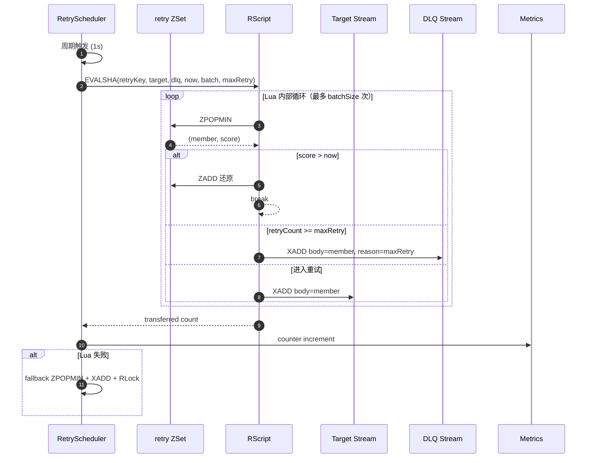
```mermaid
sequenceDiagram
    autonumber
    participant Scanner as RetryScheduler
    participant RetryZSet as retry ZSet
    participant Lua as RScript
    participant Target as Target Stream
    participant DLQ as DLQ Stream
    participant Metrics

    Scanner->>Scanner: 周期触发 (1s)
    Scanner->>Lua: EVALSHA(retryKey, target, dlq, now, batch, maxRetry)
    loop Lua 内部循环（最多 batchSize 次）
        Lua->>RetryZSet: ZPOPMIN
        RetryZSet-->>Lua: (member, score)
        alt score > now
            Lua->>RetryZSet: ZADD 还原
            Lua-->>Lua: break
        else retryCount >= maxRetry
            Lua->>DLQ: XADD body=member, reason=maxRetry
        else 进入重试
            Lua->>Target: XADD body=member
        end
    end
    Lua-->>Scanner: transferred count
    Scanner->>Metrics: counter increment
    alt Lua 失败
        Scanner->>Scanner: fallback ZPOPMIN + XADD + RLock
    end
```

### 7.5 Rebalance 时序图

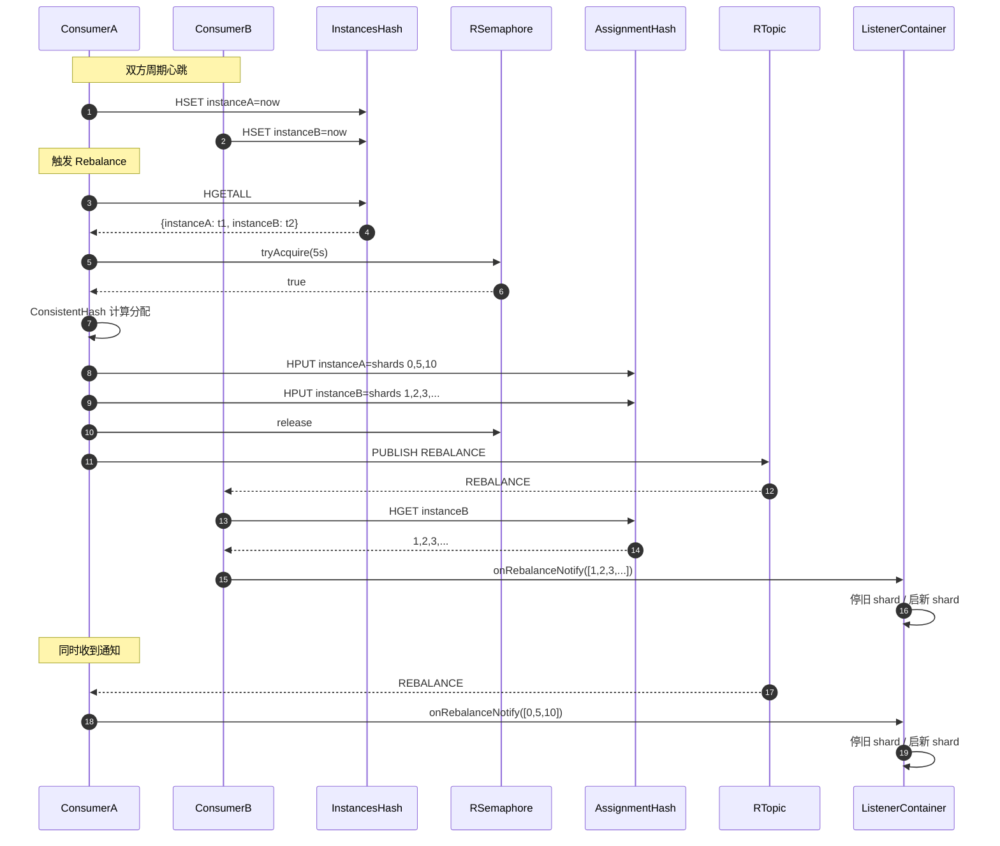
```mermaid
sequenceDiagram
    autonumber
    participant CA as ConsumerA
    participant CB as ConsumerB
    participant Instances as InstancesHash
    participant Sem as RSemaphore
    participant Assign as AssignmentHash
    participant Topic as RTopic
    participant Container as ListenerContainer

    Note over CA,CB: 双方周期心跳
    CA->>Instances: HSET instanceA=now
    CB->>Instances: HSET instanceB=now
    Note over CA: 触发 Rebalance
    CA->>Instances: HGETALL
    Instances-->>CA: {instanceA: t1, instanceB: t2}
    CA->>Sem: tryAcquire(5s)
    Sem-->>CA: true
    CA->>CA: ConsistentHash 计算分配
    CA->>Assign: HPUT instanceA=shards 0,5,10
    CA->>Assign: HPUT instanceB=shards 1,2,3,...
    CA->>Sem: release
    CA->>Topic: PUBLISH REBALANCE
    Topic-->>CB: REBALANCE
    CB->>Assign: HGET instanceB
    Assign-->>CB: 1,2,3,...
    CB->>Container: onRebalanceNotify([1,2,3,...])
    Container->>Container: 停旧 shard / 启新 shard
    Note over CA: 同时收到通知
    Topic-->>CA: REBALANCE
    CA->>Container: onRebalanceNotify([0,5,10])
    Container->>Container: 停旧 shard / 启新 shard
```

### 7.6 顺序消费时序图（含 RLock）

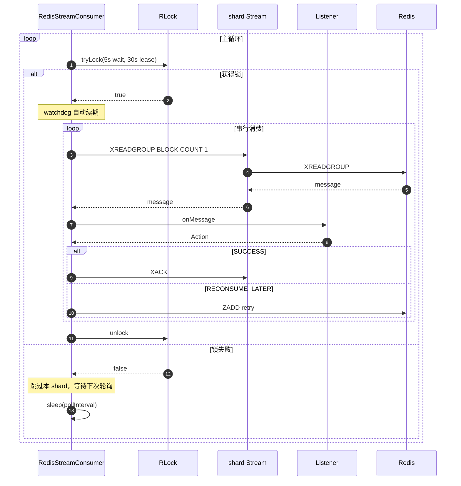
```mermaid
sequenceDiagram
    autonumber
    participant Consumer as RedisStreamConsumer
    participant RLock
    participant ShardStream as shard Stream
    participant Listener
    participant Redis

    loop 主循环
        Consumer->>RLock: tryLock(5s wait, 30s lease)
        alt 获得锁
            RLock-->>Consumer: true
            Note over Consumer: watchdog 自动续期
            loop 串行消费
                Consumer->>ShardStream: XREADGROUP BLOCK COUNT 1
                ShardStream->>Redis: XREADGROUP
                Redis-->>ShardStream: message
                ShardStream-->>Consumer: message
                Consumer->>Listener: onMessage
                Listener-->>Consumer: Action
                alt SUCCESS
                    Consumer->>ShardStream: XACK
                else RECONSUME_LATER
                    Consumer->>Redis: ZADD retry
                end
            end
            Consumer->>RLock: unlock
        else 锁失败
            RLock-->>Consumer: false
            Note over Consumer: 跳过本 shard，等待下次轮询
            Consumer->>Consumer: sleep(pollInterval)
        end
    end
```

---

## 8. 内部状态机设计

### 8.1 ListenerContainer 生命周期状态机

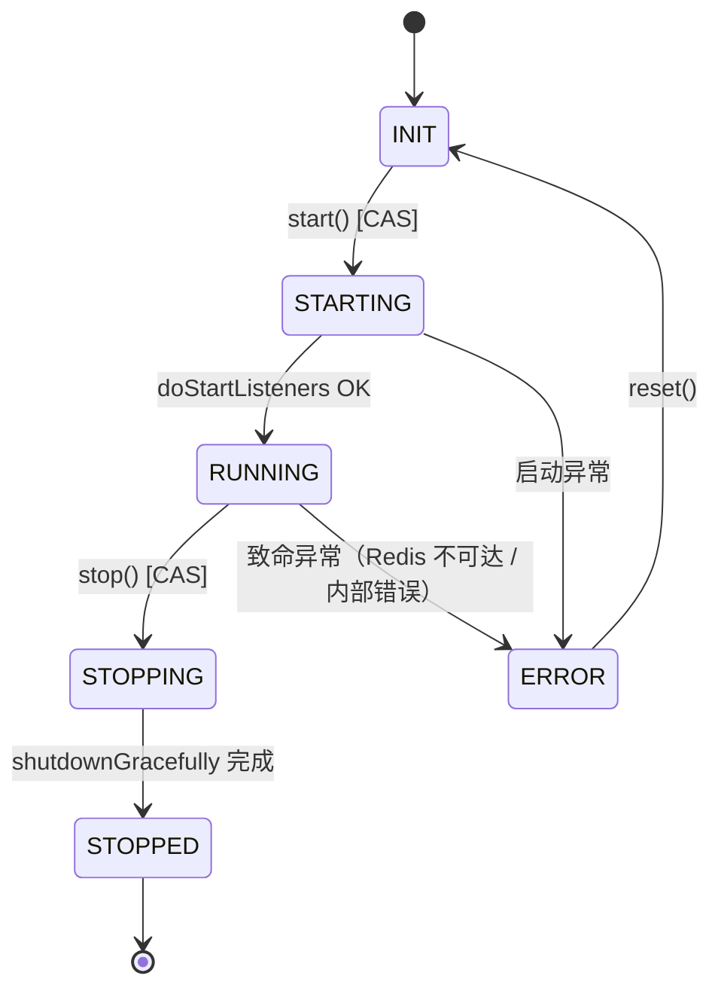
```mermaid
stateDiagram-v2
    [*] --> INIT
    INIT --> STARTING: start() [CAS]
    STARTING --> RUNNING: doStartListeners OK
    STARTING --> ERROR: 启动异常
    RUNNING --> STOPPING: stop() [CAS]
    RUNNING --> ERROR: 致命异常（Redis 不可达 / 内部错误）
    STOPPING --> STOPPED: shutdownGracefully 完成
    ERROR --> INIT: reset()
    STOPPED --> [*]
```

| 当前状态 | 允许操作 | 不允许操作 |
|---|---|---|
| INIT | start()、registerListener() | stop()、消息消费 |
| STARTING | 等待 | start()、stop() |
| RUNNING | stop()、registerListener()（运行时新增） | start() |
| STOPPING | 等待 | start() |
| STOPPED | 重启（reset → start） | 重复 stop() |
| ERROR | reset()、诊断 | 正常消息消费 |

### 8.2 事务状态机

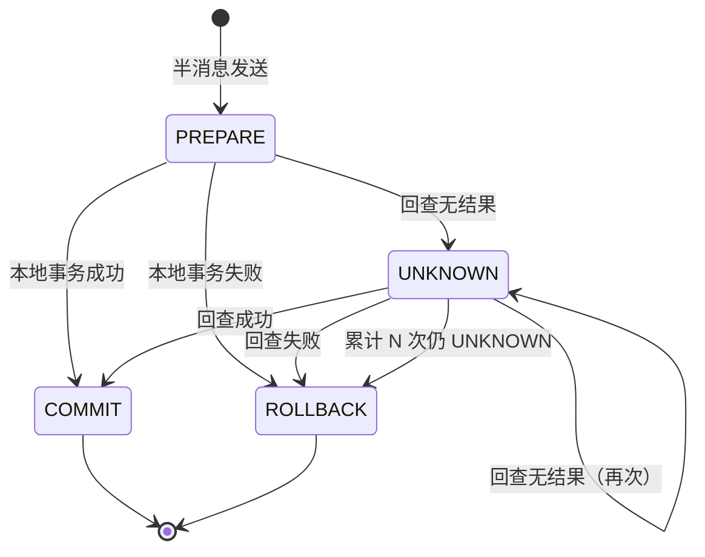
```mermaid
stateDiagram-v2
    [*] --> PREPARE: 半消息发送
    PREPARE --> COMMIT: 本地事务成功
    PREPARE --> ROLLBACK: 本地事务失败
    PREPARE --> UNKNOWN: 回查无结果
    UNKNOWN --> COMMIT: 回查成功
    UNKNOWN --> ROLLBACK: 回查失败
    UNKNOWN --> UNKNOWN: 回查无结果（再次）
    UNKNOWN --> ROLLBACK: 累计 N 次仍 UNKNOWN
    COMMIT --> [*]
    ROLLBACK --> [*]
```

| 状态 | 含义 | 业务 Stream 是否可见 |
|---|---|---|
| PREPARE | 半消息已发送，等待本地事务结果 | 否 |
| COMMIT | 本地事务提交，半消息转投业务 Stream | 是 |
| ROLLBACK | 本地事务回滚，半消息删除 | 否 |
| UNKNOWN | 回查未得到明确结果，继续等待 | 否 |

### 8.3 消息状态机

```mermaid
stateDiagram-v2
    [*] --> SEND: producer.send
    SEND --> PENDING: XADD 成功
    PENDING --> ACK: 消费成功 XACK
    PENDING --> RETRY: 消费失败 / 异常
    RETRY --> PENDING: 重试转投回到 Stream
    RETRY --> RETRY: 下次重试
    RETRY --> DLQ: 超过 maxReconsumeTimes
    ACK --> [*]
    DLQ --> [*]
```

| 状态 | 存储 | 处理逻辑 |
|---|---|---|
| SEND | 客户端内存 | Producer 构造 |
| PENDING | Stream（含 PEL） | XREADGROUP 读取 |
| RETRY | ZSet retry | 周期扫描转投 |
| ACK | （已 ACK，无存储） | 终态 |
| DLQ | Stream DLQ | 死信队列，等待人工 / 独立 Listener |

---

## 9. 异常处理与降级策略

### 9.1 Redis 不可达场景

**发送侧**：

```java
public SendResult syncSend(Message<T> message) {
    int attempts = 0;
    while (attempts < maxRetry) {
        try {
            return producer.doSyncSend(entry, message);
        } catch (RedisConnectionException | RedisTimeoutException e) {
            attempts++;
            if (attempts >= maxRetry) {
                metrics.counter("streammq.producer.send.broker.unreachable").increment();
                throw new StreamMqBrokerException("Redis unreachable after " + attempts + " attempts", e);
            }
            backoff(attempts);
        }
    }
    throw new StreamMqBrokerException("Redis unreachable");
}
```

**消费侧**：

```java
public void consumeLoop() {
    int backoffCount = 0;
    while (container.isRunning()) {
        try {
            Map<...> messages = stream.readGroup(...);
            backoffCount = 0;  // 成功一次重置
            processMessages(messages);
        } catch (RedisConnectionException e) {
            backoffCount++;
            long waitMs = Math.min(backoffCount * 1000L, 30_000L);  // 指数退避，上限 30s
            logger.warn("redis unreachable, backoff {}ms", waitMs);
            Thread.sleep(waitMs);
            // 进入 BACKOFF 状态
            if (backoffCount >= 3) {
                state.set(LifecycleState.ERROR);
                triggerReconnect();
            }
        }
    }
}
```

**心跳侧**：

```java
public void heartbeat() {
    try {
        instances.put(instanceId, System.currentTimeMillis());
        heartbeatFailCount = 0;
    } catch (RedisException e) {
        if (++heartbeatFailCount >= 3) {
            logger.error("heartbeat failed 3 times, trigger reconnect");
            triggerReconnect();
        }
    }
}

private void triggerReconnect() {
    // 1. 重新创建 RedissonClient
    // 2. 重新注册 Consumer
    // 3. 重启 ListenerContainer
    container.restart();
}
```

### 9.2 Lua 脚本失败降级

```java
private void scanRetryEntries(String topic, String group) {
    try {
        // 主路径：Lua 原子转移
        luaScript.eval(...);
    } catch (RedisException e) {
        logger.warn("lua script failed, fallback to split ops", e);
        // 降级路径：ZPOPMIN + XADD 拆分 + RLock
        fallbackSplitTransfer(retryKey, targetStream, dlqStream, now);
    }
}

private void fallbackSplitTransfer(...) {
    RLock lock = redisson.getLock(retryKey + ":transfer:lock");
    if (!lock.tryLock(5, 30, TimeUnit.SECONDS)) return;
    try {
        // 逐条 ZPOPMIN + XADD
        for (int i = 0; i < batchSize; i++) {
            // ... 拆分逻辑见 4.6
        }
    } finally {
        lock.unlock();
    }
}
```

| 失败类型 | 主路径 | 降级路径 |
|---|---|---|
| Redis 不可达 | Lua 失败 | 等待重连，不降级 |
| Lua 脚本不存在（NOSCRIPT） | EVAL 报错 | 重新 EVALSHA load 后重试 |
| Lua 执行异常 | 抛错 | ZPOPMIN + XADD 拆分 + RLock |
| Lua 超时 | 等待重试 | 同上拆分 |

### 9.3 序列化失败

```java
public SendResult syncSend(Message<T> message) {
    try {
        byte[] body = serializer.serialize(message.getPayload());
        // ...
    } catch (SerializationException e) {
        // 不可重试，直接抛出
        metrics.counter("streammq.producer.serialize.fail").increment();
        throw e;
    }
}
```

| 异常类型 | 处理策略 | 是否重试 |
|---|---|---|
| SerializationException | 直接抛出 | 否 |
| StreamMqBrokerException | 按 RetryPolicy 重试 | 是 |
| StreamMqTransactionException | 标记 ROLLBACK | 否 |
| InterruptedException | 恢复中断标志，停止 | 否 |
| RuntimeException（其他） | 包装为 StreamMqException | 默认否 |

### 9.4 Listener 长时间阻塞

```java
private void processMessage(StreamMessageId id, Map<String, byte[]> fields) {
    Future<Action> future = listenerThreads.submit(() -> {
        return listener.onMessage(message, ctx);
    });
    try {
        Action action = future.get(consumeTimeoutSeconds, TimeUnit.SECONDS);
        handleAction(action, id);
    } catch (TimeoutException e) {
        // 单消息消费超时 → cancel
        future.cancel(true);
        logger.warn("consume timeout, cancel: id={}", id);
        metrics.counter("streammq.consumer.timeout").increment();
        // 进入重试
        enqueueRetry(id, fields, e);
    } catch (ExecutionException | InterruptedException e) {
        // 异常兜底
        enqueueRetry(id, fields, e);
    }
}
```

| 场景 | 处理 |
|---|---|
| 单消息消费 < consumeTimeout | 正常处理 |
| 单消息消费 > consumeTimeout | cancel 虚拟线程，进重试 |
| Listener 死循环 | 虚拟线程 cancel 不保证停（需配合 Interruption） |
| Listener 持有外部锁 | 建议 consumeTimeout > 业务超时 |

---

## 10. 性能优化设计

### 10.1 Pipeline 批量

```java
// RBatch 在三个场景统一使用
// 1. 批量发送
public List<SendResult> doSendBatch(List<Message<?>> messages) {
    RBatch batch = redisson.createBatch();
    for (Message<?> msg : messages) {
        batch.getStream(streamKey).add(...);
    }
    BatchResult<?> result = batch.execute();
    // ...
}

// 2. 批量转投（延时 / 重试扫描）
private void scanExpired(DelayLevel level) {
    RBatch batch = redisson.createBatch();
    for (String member : expired) {
        batch.getStream(targetStream).add(...);
        batch.getScoredSortedSet(zsetKey).removeAsync(member);
    }
    batch.execute();
}

// 3. 批量 ACK
public void ackBatch(List<StreamMessageId> ids) {
    RBatch batch = redisson.createBatch();
    batch.getStream(streamKey).ack(groupName, ids.toArray(new StreamMessageId[0]));
    batch.execute();
}
```

| 场景 | 批大小 | 收益 |
|---|---|---|
| 批量发送 | 100~500 | RTT 减少 N 倍 |
| 延时转投 | 100 | 减少 ZPOPMIN 次数 |
| 重试转投 | 100 | 同上 |
| 批量 ACK | 全部 PEL 内 | 减少 XACK 次数 |

### 10.2 连接复用

```java
// 单例 RedissonClient 共享所有 Producer / Consumer
@Bean(destroyMethod = "shutdown")
public RedissonClient redissonClient(StreamMqProperties props) {
    Config config = new Config();
    config.useSingleServer()
        .setAddress(props.getRedis().getAddress())
        .setConnectionPoolSize(props.getRedis().getPoolSize())  // 默认 64
        .setConnectionMinimumIdleSize(props.getRedis().getMinIdle())  // 默认 8
        .setIdleConnectionTimeout(props.getRedis().getIdleTimeout())
        .setConnectTimeout(props.getRedis().getConnectTimeout())
        .setTimeout(props.getRedis().getCommandTimeout());
    return Redisson.create(config);
}
```

| 配置项 | 默认 | 推荐 | 说明 |
|---|---|---|---|
| connectionPoolSize | 64 | 128 | 高并发场景 |
| connectionMinimumIdleSize | 8 | 16 | 预热连接 |
| idleConnectionTimeout | 10000 | 30000 | 空闲超时 |
| connectTimeout | 10000 | 3000 | 连接超时 |
| timeout | 3000 | 3000 | 命令超时 |

### 10.3 内存优化

```java
// 1. Message 对象池（可选）
private final ObjectPool<Message<?>> messagePool =
    new SoftReferenceObjectPool<>(new BasePooledObjectFactory<>() {
        @Override
        public Message<?> create() { return new Message<>(); }
        @Override
        public void passivateObject(PooledObject<Message<?>> p) {
            p.getObject().reset();
        }
    });

// 2. Stream Entry 字段使用 byte[]，避免字符串解码
public class StreamMessage {
    private final StreamMessageId id;
    private final Map<String, byte[]> fields;  // 直接 byte[]
    // 仅在需要时调用 new String(fields.get("body"))
}

// 3. 序列化器选择
// - JSON: 通用，可读性高，体积大
// - Protobuf: 体积小，性能高，需 schema
// - Kryo: 体积小，性能高，Java 原生
```

### 10.4 背压策略

```java
public class StreamMqListenerContainer {
    // 内部队列上限（背压）
    private final BlockingQueue<StreamMessage> inflightQueue =
        new LinkedBlockingQueue<>(1000);  // 默认 1000

    public void poll() {
        while (isRunning()) {
            // 队列满 → 暂停 XREADGROUP
            if (inflightQueue.remainingCapacity() < batchSize) {
                metrics.gauge("streammq.consumer.backpressure").increment();
                Thread.sleep(100);
                continue;
            }
            // 队列有空位 → 继续 XREADGROUP BLOCK
            Map<...> messages = stream.readGroup(...);
            for (var entry : messages.entrySet()) {
                inflightQueue.put(new StreamMessage(...));  // 阻塞 put
            }
        }
    }

    public void consumeFromQueue() {
        while (isRunning()) {
            StreamMessage sm = inflightQueue.take();
            processMessage(sm);
        }
    }
}
```

| 背压阈值 | 触发动作 | 监控指标 |
|---|---|---|
| remainingCapacity < batchSize | 暂停 XREADGROUP | streammq.consumer.backpressure |
| remainingCapacity == 0 | 完全停止消费 | streammq.consumer.queue.full |
| queue.size > 800 (80%) | 告警 | streammq.consumer.queue.high |

---

## 11. 安全与可观测性内部实现

### 11.1 安全

**ManagementAuthenticator SPI**：

```java
public interface ManagementAuthenticator {
    /**
     * 校验运维端点请求
     * @return true 通过，false 拒绝
     */
    boolean authenticate(ManagementRequest request);
}

// 默认实现：拒绝所有
public class DenyAllAuthenticator implements ManagementAuthenticator {
    @Override
    public boolean authenticate(ManagementRequest request) {
        return false;
    }
}

// 用户可自定义接入企业鉴权
@Component
public class CompanyAuthenticator implements ManagementAuthenticator {
    @Override
    public boolean authenticate(ManagementRequest request) {
        return companyAuthService.verify(request.getToken());
    }
}
```

**运维端点拦截**：

```java
public class ManagementEndpointInterceptor implements HandlerInterceptor {
    private final ManagementAuthenticator authenticator;

    @Override
    public boolean preHandle(HttpServletRequest req, HttpServletResponse resp, Object handler) {
        ManagementRequest mr = new ManagementRequest(req);
        if (!authenticator.authenticate(mr)) {
            resp.setStatus(403);
            return false;
        }
        return true;
    }
}
```

### 11.2 指标

**Micrometer 指标埋点清单**：

| 指标名 | 类型 | 标签 | 说明 |
|---|---|---|---|
| `streammq.producer.send.success` | Counter | topic, group | 发送成功次数 |
| `streammq.producer.send.fail` | Counter | topic, group, reason | 发送失败次数 |
| `streammq.producer.send.latency` | Timer | topic, group | 发送延迟 |
| `streammq.consumer.consume.success` | Counter | topic, group | 消费成功次数 |
| `streammq.consumer.consume.fail` | Counter | topic, group, reason | 消费失败次数 |
| `streammq.consumer.consume.latency` | Timer | topic, group | 消费延迟 |
| `streammq.consumer.retry.queue.size` | Gauge | topic, group | 重试队列长度 |
| `streammq.consumer.dlq.message.count` | Counter | topic, group | DLQ 消息数 |
| `streammq.transaction.half.queue.size` | Gauge | txGroup | 半消息队列长度 |
| `streammq.transaction.check.count` | Counter | txGroup, status | 回查次数 |
| `streammq.rebalance.count` | Counter | group | Rebalance 次数 |
| `streammq.shard.lock.fail` | Counter | topic, group, shard | shard 锁失败次数 |

**埋点位置**：

```java
// Producer
public SendResult syncSend(Message<T> message) {
    Timer.Sample sample = Timer.start(meterRegistry);
    try {
        SendResult result = producer.doSyncSend(entry, message);
        sample.stop(Timer.builder("streammq.producer.send.latency")
            .tag("topic", message.getTopic())
            .tag("group", message.getGroup())
            .register(meterRegistry));
        meterRegistry.counter("streammq.producer.send.success",
            "topic", message.getTopic(),
            "group", message.getGroup()).increment();
        return result;
    } catch (RuntimeException e) {
        meterRegistry.counter("streammq.producer.send.fail",
            "topic", message.getTopic(),
            "group", message.getGroup(),
            "reason", e.getClass().getSimpleName()).increment();
        throw e;
    }
}
```

### 11.3 日志

**SLF4J MDC**：

```java
public class MdcTraceContext {
    public static void putTrace(String traceId, String topic, String group, String messageId) {
        MDC.put("traceId", traceId);
        MDC.put("topic", topic);
        MDC.put("group", group);
        MDC.put("messageId", messageId);
    }

    public static void clear() {
        MDC.remove("traceId");
        MDC.remove("topic");
        MDC.remove("group");
        MDC.remove("messageId");
    }
}

// 在消费入口注入
public void processMessage(StreamMessageId id, Map<String, byte[]> fields) {
    String traceId = fields.containsKey("traceId") ?
        new String(fields.get("traceId")) : UUID.randomUUID().toString();
    String messageId = new String(fields.get("messageId"));
    MdcTraceContext.putTrace(traceId, topic, groupName, messageId);
    try {
        // 业务日志中自动带上 MDC
        logger.debug("begin consume message");
        // ...
        logger.debug("end consume message");
    } finally {
        MdcTraceContext.clear();
    }
}
```

**关键节点 DEBUG 日志**：

| 节点 | 日志级别 | 内容 |
|---|---|---|
| 发送前 | DEBUG | topic, group, messageId, payload.size |
| 发送后 | DEBUG | StreamMessageId, latency |
| 消费前 | DEBUG | messageId, retryCount |
| 消费后 | DEBUG | action, latency |
| 重试入队 | DEBUG | retryKey, nextRetryAt, retryCount |
| 重试转投 | DEBUG | transferred count |
| 事务半消息发送 | DEBUG | txId, txGroup |
| 事务状态更新 | DEBUG | txId, from → to |
| 事务回查 | DEBUG | txId, checkTimes, status |
| Rebalance 触发 | INFO | instanceId, activeCount |
| Rebalance 完成 | INFO | assignment |

### 11.4 健康检查

```java
@Component
public class StreamMqHealthIndicator implements HealthIndicator {

    private final RedissonClient redisson;
    private final StreamMqListenerContainer container;
    private final StreamMqProperties properties;

    @Override
    public Health health() {
        Health.Builder builder = Health.up();
        // 1. Redis 连通性
        try {
            String pong = redisson.getNodesGroup().pingAll();
            if (!"PONG".equals(pong)) {
                builder.down().withDetail("redis", "unreachable");
            }
        } catch (Exception e) {
            builder.down().withDetail("redis", e.getMessage());
        }

        // 2. ListenerContainer 状态
        LifecycleState state = container.getState();
        if (state == LifecycleState.ERROR) {
            builder.down();
        }
        builder.withDetail("container.state", state);

        // 3. 堆积阈值
        for (var entry : container.getInflightSizes().entrySet()) {
            int size = entry.getValue();
            builder.withDetail("queue." + entry.getKey(), size);
            if (size > properties.getBackpressureThreshold()) {
                builder.down().withDetail("queue." + entry.getKey() + ".overflow", true);
            }
        }

        return builder.build();
    }
}
```

| 检查项 | UP 条件 | DOWN 条件 |
|---|---|---|
| Redis 连通 | pingAll 返回 PONG | 异常 |
| Container 状态 | RUNNING / STARTING | ERROR |
| 内部队列 | size < threshold | size >= threshold |
| Retry ZSet 大小 | < dlqThreshold | >= dlqThreshold |

---

## 12. 附录

### 12.1 内部类继承关系图

```mermaid
classDiagram
    class StreamMqTemplate~T~ {
        <<interface>>
    }
    class DefaultStreamMqTemplate~T~ {
    }
    class StreamMqListener {
        <<interface>>
    }
    class StreamMqAckListener~T~ {
        <<interface>>
    }
    class SmartLifecycle {
        <<interface>>
    }
    class StreamMqListenerContainer
    class RedisStreamConsumer
    class ConsumerGroupManager
    class RetryScheduler
    class TransactionScanner
    class DelayMessageScheduler
    class RedissonStreamProducer~T~

    DefaultStreamMqTemplate ..|> StreamMqTemplate
    StreamMqListenerContainer ..|> SmartLifecycle
    RedisStreamConsumer --> StreamMqListener : 调用
    RedisStreamConsumer --> StreamMqAckListener : 调用
    StreamMqListenerContainer --> RedisStreamConsumer
    StreamMqListenerContainer --> ConsumerGroupManager
    StreamMqListenerContainer --> RetryScheduler
    StreamMqListenerContainer --> DelayMessageScheduler
    DefaultStreamMqTemplate --> RedissonStreamProducer
    DefaultStreamMqTemplate --> TransactionScanner
```

### 12.2 算法复杂度分析表

| 算法 | 时间复杂度 | 空间复杂度 | 说明 |
|---|---|---|---|
| 同步发送 | O(1) + Redis RTT | O(payload) | XADD 单次 |
| 批量发送（n 条） | O(n) + 1 RTT | O(n × payload) | RBatch 一次 |
| 消费主循环 | O(1) + Redis RTT | O(batch × entry) | XREADGROUP |
| Rebalance (ConsistentHash) | O(M × 150 × log N) | O(M × 150) | M=实例数, N=虚拟节点 |
| Rebalance (Average) | O(M) | O(M) | 平均分配 |
| 重试扫描（batch B） | O(B log Q) | O(B) | Q=ZSet 长度 |
| 事务回查（每条） | O(1) | O(1) | ZPOPMIN + XADD |
| 延时扫描（batch B） | O(B log Q) | O(B) | 同重试 |
| 顺序消费（每 shard） | O(1) + RLock RTT | O(1) | 单条消费 |
| Listener 注册 | O(1) | O(1) | ConcurrentHashMap put |

### 12.3 Redis 命令频率估算表

（基于 1k TPS 单 topic，10 个 group，5 个 Consumer 实例）

| 命令 | 场景 | 频率估算 | QPS |
|---|---|---|---|
| XADD | 发送 | 1k TPS | 1000 |
| XREADGROUP | 消费（5 实例 × 1s BLOCK） | 5 × 1000 / batch | 500 |
| XACK | 消费成功 | ~950（失败 5%） | 950 |
| ZADD retry | 重试入队 | ~50 | 50 |
| ZPOPMIN retry | 重试扫描 | 1s × batch | 1 |
| XADD DLQ | 死信 | <1 | <1 |
| ZADD delay | 延时消息发送 | ~100 | 100 |
| ZPOPMIN delay | 延时扫描 | 1s × 9 levels | 9 |
| ZADD txcheck | 事务注册 | ~10 | 10 |
| ZPOPMIN txcheck | 事务扫描 | 60s 一次 | <1 |
| HSET instances | 心跳 | 5s × 5 实例 | 1 |
| HGETALL instances | Rebalance | 30s | 0.03 |
| SET NX shardlock | 顺序锁 | 每 shard × poll | 80 |
| PUBLISH notify | Rebalance 通知 | 30s | 0.03 |

### 12.4 配置项与内部组件映射表

| 配置项 | 内部组件 | 默认值 | 说明 |
|---|---|---|---|
| `streammq.redis.address` | RedissonClient | redis://localhost:6379 | Redis 地址 |
| `streammq.redis.pool-size` | RedissonClient | 64 | 连接池大小 |
| `streammq.producer.send-timeout-millis` | RedissonStreamProducer | 3000 | 发送超时 |
| `streammq.producer.retry.max-attempts` | DefaultStreamMqTemplate | 3 | 发送重试 |
| `streammq.producer.batch.max-size` | RedissonStreamProducer | 100 | 批量大小 |
| `streammq.producer.fail-strategy` | RedissonStreamProducer | PARTIAL_SUCCESS | 批量失败策略 |
| `streammq.consumer.group` | RedisStreamConsumer | - | 消费组名 |
| `streammq.consumer.block-millis` | RedisStreamConsumer | 2000 | XREADGROUP BLOCK 时长 |
| `streammq.consumer.batch-size` | RedisStreamConsumer | 10 | 单次拉取数 |
| `streammq.consumer.ack-mode` | RedisStreamConsumer | AUTO_ACK | ACK 模式 |
| `streammq.consumer.consume-timeout-seconds` | RedisStreamConsumer | 60 | 单消息超时 |
| `streammq.consumer.backpressure.threshold` | StreamMqListenerContainer | 1000 | 背压阈值 |
| `streammq.consumer.max-reconsume-times` | RetryScheduler | 16 | 最大重试次数 |
| `streammq.consumer.retry.scan-interval-ms` | RetryScheduler | 1000 | 重试扫描间隔 |
| `streammq.consumer.retry.batch-size` | RetryScheduler | 100 | 重试批量 |
| `streammq.rebalance.strategy` | ConsumerGroupManager | ConsistentHash | Rebalance 策略 |
| `streammq.rebalance.heartbeat-interval-ms` | ConsumerGroupManager | 5000 | 心跳间隔 |
| `streammq.rebalance.instance-timeout-ms` | ConsumerGroupManager | 20000 | 实例超时 |
| `streammq.transaction.default-group` | TransactionScanner | default-tx | 默认事务组 |
| `streammq.transaction.check-interval-seconds` | TransactionScanner | 60 | 回查间隔 |
| `streammq.transaction.max-check-times` | TransactionScanner | 15 | 最大回查次数 |
| `streammq.orderly.shard-count` | StreamMqListenerContainer | 16 | shard 数量 |
| `streammq.orderly.lock.wait-seconds` | StreamMqListenerContainer | 5 | 锁等待 |
| `streammq.orderly.lock.lease-seconds` | StreamMqListenerContainer | 30 | 锁租约 |
| `streammq.shutdown-timeout-seconds` | StreamMqListenerContainer | 30 | 优雅停机超时 |

### 12.5 变更记录

| 日期 | 版本 | 变更说明 | 作者 |
|---|---|---|---|
| 2026-06-30 | v0.1-draft | 初稿建立，含 12 章 1500+ 行，覆盖内部类 / 算法 / 线程模型 / Redis Key / 状态机 / 降级 / 性能 / 可观测 | StreamMQ 团队 |

---

> 本文档为内部实现细节，外部 API 以 03-functional-design.md 为准。
> 所有 Mermaid 图均在 GitHub / VS Code Mermaid 预览插件中可正确渲染。
> 配置项以 03-functional-design.md 第 9 章（配置属性类）为权威定义，本文档仅做内部组件映射说明。
